**TRƯỜNG ĐẠI HỌC GIAO THÔNG VẬN TẢI**

KHOA CÔNG NGHỆ THÔNG TIN

\----------

**ĐỒ ÁN TỐT NGHIỆP**

**ĐỀ TÀI:**

**PHÁT TRIỂN ỨNG DỤNG ĐẶT LỊCH CẮT TÓC**

| Giảng viên hướng dẫn | : **TS. Hoàng Văn Thông**      |
|----------------------|--------------------------------|
| Sinh viên thực hiên  | : **Lê Quang Thọ** - 181202289 |
| Lớp                  | : Công nghệ thông tin 1 - K59  |

**Hà Nội, 2022**

**TRƯỜNG ĐẠI HỌC GIAO THÔNG VẬN TẢI**

KHOA CÔNG NGHỆ THÔNG TIN

\----------

**ĐỒ ÁN TỐT NGHIỆP**

**ĐỀ TÀI:**

**PHÁT TRIỂN ỨNG DỤNG ĐẶT LỊCH CẮT TÓC**

| Giảng viên hướng dẫn | : **TS. Hoàng Văn Thông**      |
|----------------------|--------------------------------|
| Sinh viên thực hiên  | : **Lê Quang Thọ** - 181202289 |
| Lớp                  | : Công nghệ thông tin 1 - K59  |

**Hà Nội, 2022**

#### Lời cảm ơn

Sau quá trình tìm hiểu, khảo sát, nghiên cứu và thực hiện đến nay, đề tài **“Phát triển ứng dụng đặt lịch cắt tóc”** của em đã hoàn thành. Trong suốt quá trình thực hiện đề tài, em đã nhận được rất nhiều sự giúp đỡ nhiệt tình của TS.Hoàng Văn Thông, giảng viên trực tiếp phụ trách hướng dẫn đề tài đồ án tốt nghiệp. Sự hướng dẫn tận tình của thầy đã giúp em có thêm nhiều kiến thức, khắc phục được những lỗi cơ bản còn tồn đọng để đồ án được hoàn thiện tốt hơn. Qua những hướng dẫn tận tâm của thầy đã giúp chúng em còn thêm hành trang trong hành trình phát triền sắp tới.

Em xin chân thành cảm ơn các thầy các cô đã trang bị những kiến thức quý báu cho chúng em trong suốt quá trình học tập tại mái trường thân yêu này.Đặc biệt là các thầy các cô trong khoa Công nghệ thông tin đã tận tình giảng dạy, chỉ bảo, trang bị cho em những kiến thức cần thiết nhất trong suốt quá trình học tập và nghiên cứu tại khoa, đã tạo mọi điều kiện thuận lợi giúp em thực hiện đề tài lớn này.

Em cũng xin gửi lời cảm ơn đến các anh chị trong Tulpo Software đã tạo điều kiện cho em có môi trường học tập và nghiên cứu để hoàn thành đồ án. Quá trình thực tập tại đây đã cho em rất nhiều kiến thức, kĩ năng quan trọng.

Với kinh nghiệm còn rất ít, cùng với kiến thức còn hạn chế, tuy em đã cố gắng nỗ lực hết mình nhưng đề tài của em vẫn không tránh khỏi những thiếu sót. Em mong nhận được những đóng góp về thiếu sót trong đề tài của em từ thầy cô để em có thể rút kinh nghiệm cho những ứng dụng tiếp theo.

Em xin chân thành cảm ơn!

Sinh viên thực hiện

**Lê Quang Thọ  
**

#### Mục lục

[Lời cảm ơn](#_Toc105789314)

[Mục lục](#mục-lục)

[Danh mục viết tắt](#danh-mục-viết-tắt)

[Danh mục hình ảnh](#danh-mục-hình-ảnh)

[Danh mục bảng biểu](#danh-mục-bảng-biểu)

[Lời nói đầu](#_Toc105789319)

[CHƯƠNG 1: Khảo sát bài toán và lựa chọn công nghệ](#khảo-sát-bài-toán-và-lựa-chọn-công-nghệ)

[1.1. Khảo sát](#khảo-sát)

[1.2. Kết quả khảo sát](#kết-quả-khảo-sát)

[1.2.1. Chuỗi cửa hàng PhongBVB](#chuỗi-cửa-hàng-phongbvb)

[1.2.2. Chuỗi cửa hàng 30 Shine](#chuỗi-cửa-hàng-30-shine)

[1.2.3. Khảo sát cơ sở cơ sở 1 của Cahoi Barbershop](#khảo-sát-cơ-sở-cơ-sở-1-của-cahoi-barbershop)

[1.3. Lựa chọn công nghệ](#_Toc105789326)

[1.4. Cơ sở lý thuyết](#cơ-sở-lý-thuyết)

[1.4.1. Công nghệ Flutter](#công-nghệ-flutter)

[1.4.2. Công nghệ Laravel – Lumen](#công-nghệ-laravel--lumen)

[1.4.3. Hệ quản trị cơ sở dữ liệu MySQL](#hệ-quản-trị-cơ-sở-dữ-liệu-mysql)

[CHƯƠNG 2: Thiết kế hệ thống](#thiết-kế-hệ-thống)

[2.1. Thiết kế hệ thông](#thiết-kế-hệ-thông)

[2.1.1. Bài toán đặt ra](#bài-toán-đặt-ra)

[2.1.2. Quy trình nghiệp vụ](#quy-trình-nghiệp-vụ)

[2.1.3. Mô hình use case](#mô-hình-use-case)

[2.1.4. Danh sách tác nhân](#danh-sách-tác-nhân)

[2.1.5. Danh sách use case và mô tả](#danh-sách-use-case-và-mô-tả)

[2.1.6. Đặc tả các yêu cầu chức năng](#đặc-tả-các-yêu-cầu-chức-năng)

[2.2. Mô hình quan hệ thực thể](#mô-hình-quan-hệ-thực-thể)

[2.2.1. Mô tả bảng](#_Toc105789345)

[2.2.2. Sơ đồ phân rã chức năng](#sơ-đồ-phân-rã-chức-năng)

[2.2.3. Sơ đồ thực thể quan hệ](#sơ-đồ-thực-thể-quan-hệ)

[2.2.4. Biểu đồ lớp](#biểu-đồ-lớp)

[CHƯƠNG 3: Cài đặt và thử nghiệm](#cài-đặt-và-thử-nghiệm)

[3.1. Môi trường cài đặt](#môi-trường-cài-đặt)

[3.2. Giao diện và chức năng](#giao-diện-và-chức-năng)

[3.2.1. Chức năng đăng kí, đăng nhập, đăng xuất](#chức-năng-đăng-kí-đăng-nhập-đăng-xuất)

[3.2.2. Chức năng đặt lịch cắt tóc](#chức-năng-đặt-lịch-cắt-tóc)

[3.2.3. Chức năng báo cáo của thợ cắt tóc](#chức-năng-báo-cáo-của-thợ-cắt-tóc)

[3.2.4. Chức năng đăng bài từ ảnh nhân viên báo cáo](#chức-năng-đăng-bài-từ-ảnh-nhân-viên-báo-cáo)

[3.2.5. Chức năng like bài viết](#chức-năng-like-bài-viết)

[3.2.6. Chức năng xóa bài viết](#chức-năng-xóa-bài-viết)

[Kết luận](#kết-luận)

[Tài liệu tham khảo](#_Toc105789360)

#### Danh mục viết tắt

| **STT** | **Thuật ngữ, từ viêt tắt** | **Giải thich**                    | **Ghi chú** |
|---------|----------------------------|-----------------------------------|-------------|
| 1       | UI                         | User Interface                    |             |
| 2       | UX                         | User Experience                   |             |
| 3       | CSDL                       | Cơ sở dữ liệu                     |             |
| 4       | GPU                        | Graphics processing unit          |             |
| 5       | SDK                        | Software development kit          |             |
| 6       | APP                        | Application                       |             |
| 7       | API                        | Application Programming Interface |             |

#### Danh mục hình ảnh

[Hình 1.1. Trang chủ PhongBVB](#_Toc105789361)

[Hình 1.2. Trang chủ của 30 Shine](#_Toc105789362)

[Hình 1.3. Màn hình đặt lịch trên web của 30 Shine](#_Toc105789363)

[Hình 1.4. Thông tin về những lần sử dụng dịch vụ trước đó trên mobile](#_Toc105789364)

[Hình 1.5. Flutter hỗ trợ đa nền tảng [1]](#_Toc105789365)

[Hình 1.6. Màn hình phpMyAdmin](#_Toc105789366)

[Hình 2.1. Sơ đồ phân làn quy trình đặt lịch](#_Toc105789367)

[Hình 2.2. Sơ đồ phân làn quy trình tạo hoá đơn](#_Toc105789368)

[Hình 2.3. Sơ đồ use case tổng quan](#_Toc105789369)

[Hình 2.4. Sơ đồ use case người dùng cơ bản](#_Toc105789370)

[Hình 2.5. Sơ đồ use case quản trị hệ thống](#_Toc105789371)

[Hình 2.6. Sơ đồ use case quản lí lịch](#_Toc105789372)

[Hình 2.7. Danh sách các tác nhân](#_Toc105789373)

[Hình 2.8. Biểu đồ trình tự use case đăng nhập](#_Toc105789374)

[Hình 2.9. Biểu đồ trình tự use case đăng kí](#_Toc105789375)

[Hình 2.10. Biểu đồ trình tự use case quên mật khâu](#_Toc105789376)

[Hình 2.11. Biểu đồ trình tự use case tạo lịch sử dụng dịch vụ](#_Toc105789377)

[Hình 2.12. Biểu đồ trình tự use case huỷ lịch sử dụng dịch vụ](#_Toc105789378)

[Hình 2.13. Biểu đồ trình tự use case tạo lịch sử dụng dịch vụ](#_Toc105789379)

[Hình 2.14. Biểu đồ trình tự use case tạo hoá đơn thanh toán](#_Toc105789380)

[Hình 2.15. Sơ đồ phân rã chức năng](#_Toc105789381)

[Hình 2.16. Sơ đồ thực thể quan hệ](#_Toc105789382)

[Hình 2.17. Biểu đồ lớp](#_Toc105789383)

[Hình 3.1. Các phương hình thức đăng nhập](#_Toc105789384)

[Hình 3.2. Validate số điện thoại](#_Toc105789385)

[Hình 3.3. Lựa chọn đăng nhập với Facebook hoặc Google](#_Toc105789386)

[Hình 3.4. Hệ thống gửi mã xác thực về số điện thoại](#_Toc105789387)

[Hình 3.5. Yêu cầu người dùng nhập mã xác thực](#_Toc105789388)

[Hình 3.6. Màn hình đăng ký - validate tên và mật khẩu](#_Toc105789389)

[Hình 3.7. Màn hình nhập mật khẩu](#_Toc105789390)

[Hình 3.8. Màn hình đăng xuất](#_Toc105789391)

[Hình 3.9. Màn hình chính](#_Toc105789392)

[Hình 3.10. Màn hình đặt lịch](#_Toc105789393)

[Hình 3.11. Chọn cơ sở muốn tới](#_Toc105789394)

[Hình 3.12. Lựa chọn dịch vụ mong muốn](#_Toc105789395)

[Hình 3.13. Chọn ngày, thợ cắt tóc và giờ](#_Toc105789396)

[Hình 3.14. Thao tác hủy lịch](#_Toc105789397)

[Hình 3.15. Màn hình chính của thợ cắt tóc](#_Toc105789398)

[Hình 3.16. Trạng thái của lịch đặt của khách](#_Toc105789399)

[Hình 3.17. Báo cáo và xác nhận khách đã thanh toán](#_Toc105789400)

[Hình 3.18. Báo cáo thành công](#_Toc105789401)

[Hình 3.19. Lịch sử đặt lịch](#_Toc105789402)

[Hình 3.20. Thêm mô tả cho bài đăng](#_Toc105789403)

[Hình 3.21. Like bài viết](#_Toc105789404)

[Hình 3.22. Xóa bài viết](#_Toc105789405)

#### Danh mục bảng biểu

[**Bảng 2.1.** Danh sách use case và mô tả](#_Toc105789406)

[**Bảng 2.2.** Đặc tả use case đăng nhập](#_Toc105789407)

[**Bảng 2.3.** Đặc tả use case đăng kí](#_Toc105789408)

[**Bảng 2.4.** Đặc tả use case đăng xuất](#_Toc105789409)

[**Bảng 2.5.** Đặc tả use case xem lịch sử lịch hẹn](#_Toc105789410)

[**Bảng 2.6.** Đặc tả use case đánh giá nhân viên](#_Toc105789411)

[**Bảng 2.7.** Đặc tả use case đăng bài](#_Toc105789412)

[**Bảng 2.8.** Mô tả use case xem tất các bài viết trong tháng](#_Toc105789413)

[**Bảng 2.9.** Mô tả use case like/unlike (tưởn tác với bài viết)](#_Toc105789414)

[**Bảng 2.10.** Đặc tả use case xoá bài viết](#_Toc105789415)

[**Bảng 2.11.** Đặc tả use case tạo hoá đơn mới](#_Toc105789416)

[**Bảng 2.12.** Đặc tả use case thống kê cuối ngày](#_Toc105789417)

[**Bảng 2.13.** Bảng users](#_Toc105789418)

[**Bảng 2.14.** Bảng ranks](#_Toc105789419)

[**Bảng 2.15.** Bảng bills](#_Toc105789420)

[**Bảng 2.16.** Bảng calendars](#_Toc105789421)

[**Bảng 2.17.** Bảng calender_stylist](#_Toc105789422)

[**Bảng 2.18.** Bảng discounts](#_Toc105789423)

[**Bảng 2.19.** Bảng Facilities](#_Toc105789424)

[**Bảng 2.20.** Bảng imgae_products](#_Toc105789425)

[**Bảng 2.21.** Bảng image_tasks](#_Toc105789426)

[**Bảng 2.22.** Bảng likes](#_Toc105789427)

[**Bảng 2.23.** Bảng model_has_permissions](#_Toc105789428)

[**Bảng 2.24.** Bảng model_has_roles](#_Toc105789429)

[**Bảng 2.25.** Bảng permissions](#_Toc105789430)

[**Bảng 2.26.** Bảng posts](#_Toc105789431)

[**Bảng 2.27.** Bảng products](#_Toc105789432)

[**Bảng 2.28.** Bảng roles](#_Toc105789433)

[**Bảng 2.29.** Bảng role_has_permissions](#_Toc105789434)

[**Bảng 2.30.** Bảng stylists](#_Toc105789435)

[**Bảng 2.31.** Bảng tasks](#_Toc105789436)

[**Bảng 2.32.** Bảng task_products](#_Toc105789437)

[**Bảng 2.33.** Bảng time_slots](#_Toc105789438)

[**Bảng 2.34.** Bảng type_products](#_Toc105789439)

#### Lời nói đầu

Ngày nay, với sự phát triển của xã hội thì viễc sử dụng thiết bị di động thông minh để phục vục cho các công việc khác nhau trong cuộc sống đã khá phổ biến. Từ những viễc như đi chợ mua sắm, đặt bàn ăn, thanh toán hoá đơn, thậm chí kể cả nộp phạt lỗi vi phạm giao thông cũng đã có thể thao tác trên các thiết bị số.

Có một câu chuyện thực tế trong những lần đi cắt tóc. Chắc hẳn ai cũng đã từng trải qua cảm giác khó chịu khi tới tiệm cắt tóc. Có thể vì số lượng khách hàng quá đông hoặc tiệm cắt tóc không có một quy trình sắp xếp hợp lí đã dẫn tới việc nhiều khách hàng đến sau nhưng được phục vụ trước, người đến trước lại phải đợi trong trạng thái bực bội.

Hay một vấn đề khác, đối với các khách hàng thân thiết của tiệm thì họ có thể áng chừng được thời điểm vắng khách để tới tiệm. Tuy nhiên đối với các khách hàng mới thì lại họ lại không có cách nào để biết được điều đó. Nếu lần đầu tiên họ tới tiệm và gặp phải những vấn đề lộn xộn như vậy thì thường tỉ lệ quay lại sử dụng dịch vụ là rất thấp.

Đó cũng chỉ là 1 vài trong số rất nhiều những vấn đề của khách hàng. Còn đối chủ tiệm, và nhân viên của tiệm thì sao. Với đối tượng này thì họ cần có những công cụ để quản lí, thống kê để có thế có những tính toán cho sự phát triển lâu dài và mở rộng. Đồng thời có thể tạo ra độ chuyện nghiệp.

Từ những vấn đề trên, trong báo cáo lần này. Em sẽ trình bày về ứng dụng đặt lịch cắt tóc cho một chuỗi tiệm cắt tóc. Tất nhiên việc đặt lịch không thể chính xác 100% về thời gian được. Cũng giống như các ứng dụng đặt lịch khác hoặc đặt vé các lại,… Ở đây đặ thù của đề tài, thời gian sẽ là tương đối, nhưng sẽ vô cùng hữu ích vì nhân viên có thể điều tiết và chuẩn bị sẵn sàng phục vụ khách. Khách hàng cũng có quyền chủ động hơn về thời gian, tối ưu hoá hơn cho cả hai bên. Không chỉ giải quyết vấn đề của khách hàng và nhân viên mà nó còn hướng tới việc xây dụng cộng đồng về chăm sóc tóc cho nam. Một vấn đề mà rất nhiều nam giới còn chưa chú ý tới.

# Khảo sát bài toán và lựa chọn công nghệ

## Khảo sát

Kế hoạch khảo sát đầu tiên sẽ là trải nghiệm thử các sản phẩm tương tự tại các chuỗi tiệm chăm sóc tóc nam khác như:

-   PhongBVB
-   30 Shine

Khảo sát nghiệp vụ sẽ được thực hiện tại tiệm cắt tóc Cahoi Barbershop cơ sở 1 tại Trần Hữu Tước, Đống Đa, Hà Nội.

## Kết quả khảo sát

### Chuỗi cửa hàng PhongBVB

Đối với chuỗi cửa hàng này đang sử dụng website <https://phongbvb.com/>. Họ đang không có chức năng đặt lịch trên trang web.

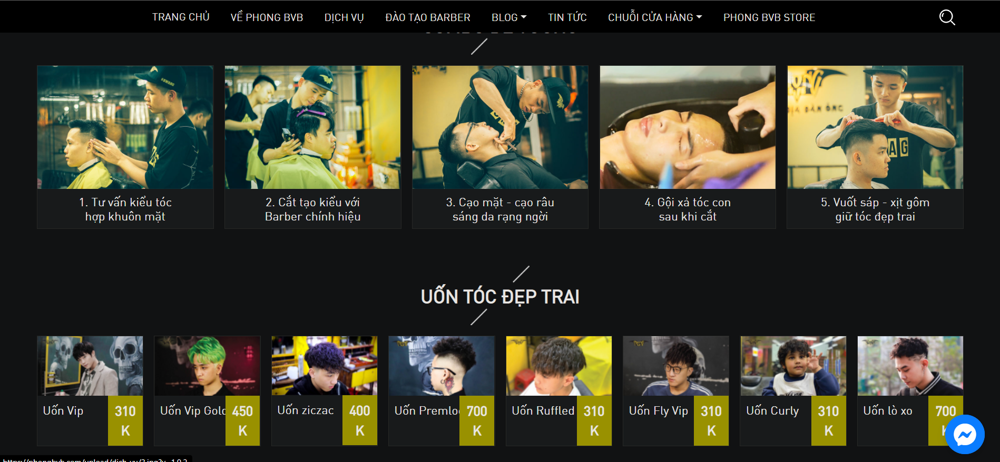

Hình 1.1. Trang chủ PhongBVB

Tại trang web này tập trung chủ yêu đẩy mạnh marketing, công khai giá dịch vụ,....Khảo sát chuỗi cửa hàng này nhận thấy:

-   Các dịch vụ sẽ bao gồm các gói dịch vụ đi theo Combo
-   Các dịch vụ có thời gian kéo dài trung bình khoảng 30 – 45 phút.
-   Trải nghiệm thực tế dịch vụ thì sau khi sử dụng dịch vụ nhân viên thường xin phép khách để lưu lại hình ảnh với mục đích báo cáo.
-   Nhân viên ở cửa hàng sau khi phục vụ xong cho khách thì thường giới thiếu với khách “Em là A lần sau anh tới thì bảo với nhân viên thu ngân là xếp lịch với bạn A nhé!”

Việc chuỗi này chưa có chức năng đặt lịch, nhân viên phải nhắc khách hẹn lịch với nhân viên. Vì vậy ứng dụng trong đề tài này sẽ khắc phục điều này bằng cách cho người dùng chọn nhân viên phục vụ hoặc chọn xếp ngẫu nhiên. Sau mỗi lần cắt thì sẽ lưu lại cả thông tin của nhân viên phục vụ trước đó và người dùng có thể xem lại.

### Chuỗi cửa hàng 30 Shine

Đây là một hệ thống chuỗi cửa hàng cắt tóc nam có thể nói là lớn nhất tại Việt Nam với khoảng gần 70 cơ sở trên khắp cả nước. Đặc biệt tại TP. Hồ Chí Minh có tới 40 cơ sở.

Chuỗi cửa hàng này cho phép đặt lịch trên nền tảng web và mobile.

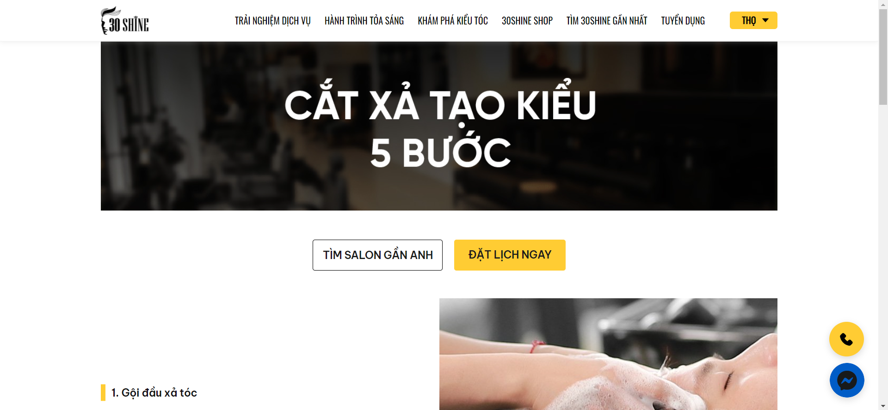

Hình 1.2. Trang chủ của 30 Shine

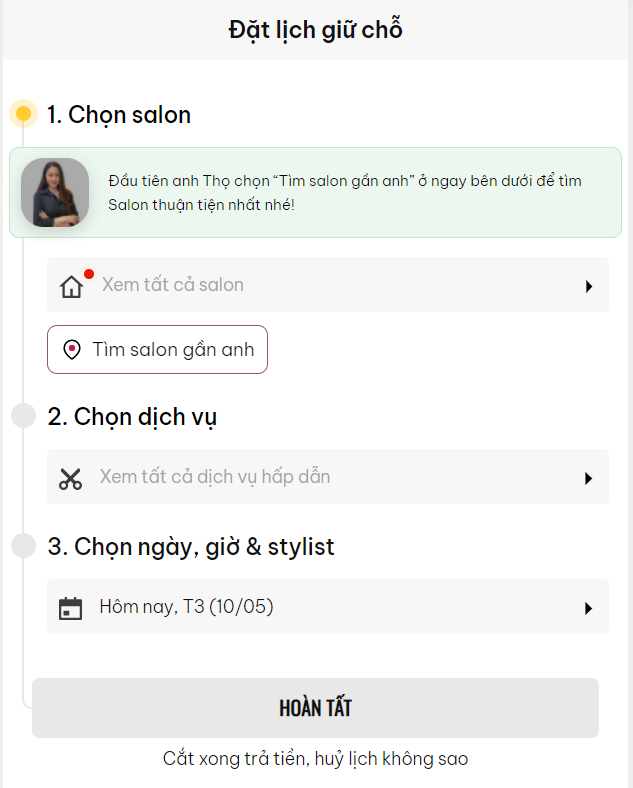

Hình 1.3. Màn hình đặt lịch trên web của 30 Shine

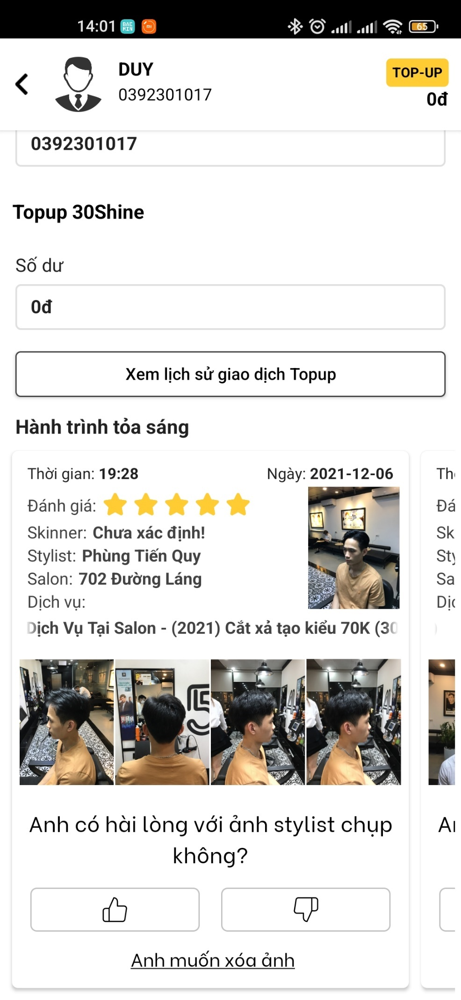

Hình 1.4. Thông tin về những lần sử dụng dịch vụ trước đó trên mobile

Sau khi khảo sát tại 30 Shine, nhận thấy ứng dụng của họ đã phát triển rất hoàn thiện và có rất nhiều điều có thể học hỏi. Từ việc tìm cửa hàng gần với mình nhất. Xem thông tin về cơ sở nào có bãi đậu ô tô. Chọn nhân viên skin care riêng, nhân viên cắt tóc riêng.

Tại 30 Shine cũng có những gói combo tương tự như PhongBVB nhưng đa dạng hơn. Không chỉ tập trung chăm sóc tóc mà tại đây còn có các dịch vụ đi kèm khác như cắt móng tay, massage mặt, skin care.

Trong phần chọn lịch, phần chọn giờ. Khách hàng sẽ chọn theo các mốc thời nhất định dựa theo ngày và nhân viên cắt tóc đã chọn. Nếu mốc nào đã được đặt thì sẽ không thể đặt.

### Khảo sát cơ sở cơ sở 1 của Cahoi Barbershop

Cahoi Barbershop là một chuỗi cửa hàng mới nên chưa có ứng dụng hay trang web để đặt lịch. Thường khách hàng muốn đặt sẽ gọi điện cho cửa hàng để đặt, hoặc nhắn tin qua Facebook. Chuỗi cửa hàng này có phong cách cổ điển.

Sau khi khảo sát nhận thấy tại chuỗi này các dịch vụ thưởng kéo dài trung bình 40 phút. Khách hàng có thể yêu cầu nhân viên nào sẽ cắt tóc cho mình. Một số trường hợp khách tới trễ so với lịch thì sẽ phải chấp nhận chờ đợi nếu toàn bộ nhân viên tại cửa hàng bận.

Nhân viên phục vụ cho khách sẽ trực tiếp thu tiền của khách. Cuối ngày sẽ nộp lại cho người quản lí.

## Lựa chọn công nghệ

Trải quan rất nhiều năm phát triển, hiện nay lĩnh vực lập trình thiết bị di động đã có rất nhiều công nghệ mới, hỗ trợ mạnh mẽ cho các lập trình viên. Lập trình thiết bị di động nói chung, ở thời điểm hiện tại phổ biến nhất vẫn là ngôn ngữ Java, C++, C\#, Swift, … Dựa trên những ngôn ngữ lập trình đó đã có những công nghệ khác hướng tới lập trình đa nền tảng ví dụ điển hình đó là Kotlin, React Native, Flutter, … . Những công nghệ này giúp cho lập trình viên có thể chỉ cần viết mã lệnh một lần nhưng có thể triển khai cài đặt trên 2 hoặc nhiều hệ điều hành khác nhau. Hiệu năng của các sản phẩm sử dụng những công nghệ mới cũng rất tốt.

Trong khoảng 3 - 4 năm trở lại đây công nghệ Flutter đang có những bước phát triển mạnh mẽ và phần nào phổ biến hơn, có phần nổi trội hơn so với các công nghệ tương tự đã có trước đó như React Native.

Tương tự với lĩnh lực lập trình thiết bị di động, về phía back-end cũng có rất nhiều công nghệ hỗ trợ mạnh mẽ cho các lập trình viên có thể tạo ra các API một cách nhanh chóng và thuật tiện.

Với nhiều công nghệ phát triển ở cả hai tầng (front-end, back-end) như vậy, để chọn ra một công nghệ tối ưu sẽ rất đa dạng. Tuy nhiên, với đề tải đồ án tốt nghiệp này em lựa chọn công nghệ Flutter cho tầng front-end, cụ thể hơn là ứng dụn di động. Tầng back-end sẽ sử dụng công nghệ Laravel – Lumen kết hợp với cơ sở dữ liệu quan hệ mySQL.

Lí do lựa chọn Flutter thay vì các công nghệ khác, ngôn ngữ khác như Java, React Native,… .là vì Flutter tối ưu hơn về nhiều mặt. Và lí do chọn Laravel – Lumen cũng tương tự như vậy. Ở phần sau sẽ nói chi tiết hơn về những ưu và nhược điểm của những công nghệ được lựa chọn trong đề tài đồ án tốt nghiệp này.

## Cơ sở lý thuyết

### Công nghệ Flutter

1.  Tổng quan Flutter

Flutter là bộ công cụ giao diện người dùng do Google phát triển để tạo các ứng dụng đẹp và nhanh chóng. Nó cho phép biên dịch native cho mobile, web, desktop từ một mã nguồn duy nhất. Dễ dàng tạo các animation trong ứng dụng.

Flutter là một framework mã nguồn mở miễn phí, công khai trên github và được phát hành vào khoảng tháng 5 năm 2017. Với Fluter, chỉ cần một ngôn ngữ duy nhất và viết code một lần là đã có thể tạo ra các ứng dụng chạy trên nhiều nền tảng khác nhau(ví dụ như ứng dụng iOS, Android, Web, …). Hiện Flutter đã hỗ trợ biên dịch để tạo ra ứng dụng chạy được trên hệ điều hành MacOS và Windows.

Flutter là một framework mới, hiện đại, dễ dàng học, làm quen và sử dụng. Flutter cung cấp sẵn rất nhiều widget, platform và layout cho người dùng và cũng dễ dàng custom. Tài liệu tham khảo rõ ràng, dễ hiểu. Trang [pub.dev](https://pub.dev) là nơi cho phép các lập trình viên có thể tìm kiểm các thư viện có tích hợp vào dự án đã được kiểm duyệt và đánh giá.

-   Ưu điểm:
    -   Trong gói SDK của Flutter đã có sẵn công cụ dành cho Developer (DEV Tool). Đây là một công cụ vô cùng hữu ích dành cho lập trình viên. Với công cụ này, lập trình viên có thể theo dõi rất nhiều thông số như căn chỉnh giao diện, theo dõi NetWork, theo dõi quá trình render của app, hiệu xuất app, … Giúp debug nhanh hơn.
        -   Flutter có thế mạnh về animation, ứng dụng được tại ra có hiệu xuất rất cao do cơ chế render có thể giao tiếp trực tiếp với GPU. gần như giao tiếp trực tiếp với native.
        -   UI/UX Android và iOS trên hai nền tảng này có thể giống hệt nhau vì không sử dụng tầng UI có sẵn của native.
        -   Hỗ trợ đa nền tảng: Android, iOS, Windowns, MacOS, Web, … .

Hình 1.5. Flutter hỗ trợ đa nền tảng [1]

-   Nhược Điểm:
    -   Bộ render UI gần như viết lại, không liên quan tới UI có sẵn của Framework native, dẫn đến sử dụng khá nhiều bộ nhớ.
        -   Cần học ngôn ngữ Dart
-   Các phiên bản nâng cấp nhẹ, sử lỗi được cập nhật liên tục và hằng ngày. Đây vừa là điểm mạnh cũng là một phần nhỏ yếu điểm của Flutter
-   Flutter là một framework còn khá là mới, phiên bản hiện tại là 2.x, tuy nhiên cộng đồng phát triển lại rất mạnh và có xu hướng phát. Ở Việt Nam mới nổi lên trong 2, 3 năm gần đây.
1.  Tổng quan về ngôn ngữ Dart

Dart là ngôn ngữ lập trình mới, được phát triển bởi Google. Dart được sử dụng để xây dựng các loại ứng dụng: di động (IOS và Android), Web,… với công cụ Flutter

Dart là ngôn ngữ hỗ trợ lập trình hướng đối tượng, cú pháp kiểu C, mã code Dart có thể biên dịch thành JavaSript để chạy trên trình duyệt. Vì là một ngô ngữ huớg đối tượng nên Dart cũng có khái niệm lập trình hiện đại như giao diện lớp, lớp trừu tượng ...

Từ ngôn ngữ lập trình Dart, Google đã phát triển bộ SDK Futter để phát triển ứng dụng di động chạy đa nền tảng (Một lần viết code có thể build ra ứng dụng cho rất nhiều nền tảng khác nhau như iOS và Android, Web, Desktop, …).

### Công nghệ Laravel – Lumen

1.  Tổng quan về framwork Laravel – Lumen

Lumen và Laravel là hai framework PHP cùng được phát triển bởi Taylor Otwell. Theo tác giả, Lumen không có ý định thay thế Laravel. Lumen được tạo ra để làm hệ thống microservices – một hệ thống nhỏ hơn để hỗ trợ các hệ thống lớn như Laravel. Trong đề tài này em chọn Lumen thay vì Laravel là vì Lumen tập trung chủ yếu để viết APIs còn Laravel hỗ trợ cả UI và các chức năng dư thừa khác không dùng tới.

Lumen là một framework mã nguồn mở. Một được thiết kế theo mô hình MVC (Model, View, Controller), toàn bộ source code đuọc công khai trên github. Laravel - cụ thể hơn là Lumen được đánh giá là một trong những framework có cú pháp đẹp, ngắn gọn và dễ nhớ nhất trong các PHP Framework. Không cần chỉnh sử thêm quá nhiều về mặt kiến trúc ngay khi bắt đầu tạo một dự án mới.

Laravel – Lumen đã trải qua nhiều lần chỉnh sửa và nâng, nó ngày càng chứng minh được những nỗ lực trong việc cố gắng đem lại cho lập trình viên những trải nghiệm tốt nhất. Laravel có những tính năng phục vụ cho quá trình phát triển web như: Database Abstract Layer, Queues, Scheduled jobs, Unit and integration testing …

1.  Tổng quan về ngôn ngữ PHP

PHP - Personal Home Page hay PHP Hypertext Preprocessor, là một ngôn ngữ lập trình kịch bản được chạy ở phía Server nhằm sinh ra mã HTML trên Client.

PHP đã trải qua rất nhiều phiên bản chỉnh sử và được tối ưu hóa cho các ứng dụng Web, với cách viết mã rõ rãng, tốc độ nhanh, dễ học nên PHP đã trở thành một ngôn ngữ lập trình Web rất phổ biến và được ưa chuộng.

Ngôn ngữ, các thư viện, tài liệu gốc của PHP được xây dựng bởi cộng đồng và có sự đóng góp rất lớn của Zend Inc. Nên đã tạo ra một môi trường chuyên nghiệp cho phép phát triển ứng dụng ở quy mô lớn.

PHP được dùng để tạo ra nhiều ứng dụng web khác nhau, bao gồm cả Wordpress, nhờ việc tích hợp dễ dàng với cơ sở dữ liệu như MySQL.

Các loại thẻ PHP: Có 4 loại thẻ khác nhau mà bạn có thể sử dụng để thiết kế một trang PHP đó là:

-   Kiểu Short: Thẻ mặc định mà các nhà lập trình PHP thường sử dụng.
-   Kiểu định dạng XML: Thẻ này có thể sử dụng với văn bản định dạng XML.
-   Kiểu Script: Trong trường hợp bạn sử dụng PHP như một script tương tự khai báo JavaScript.
-   Kiểu ASP: Trong trường hợp bạn khai báo thẻ PHP như một phần trong ASP.

Các kiểu dữ liệu: Dữ liệu đến từ Script đều là biến PHP bạn có thể nhận biết bằng ký hiệu **\$** phía trước.

Biến giá trị: PHP quy định một biến được biểu diễn bắt đầu bằng dấu \$, sau đó là một chữ cái hoặc dấu gạch dưới.

-   Ưu điểm**:**
-   PHP là mã nguồn mở
-   Tốc độ nhanh và dễ sử dụng
-   Chạy được nhiều hệ điều hành.
-   Truy cập được bất kỳ loại CSDL nào
-   Nhược điểm:
-   PHP còn hạn chế về cấu trúc ngữ pháp. Nó không được thiết kế gọn gang và không được đẹp mắt như ngôn ngữ lập trình khác.
-   PHP chỉ có thể hoạt động và sử dụng trên các ứng dụng web.

### Hệ quản trị cơ sở dữ liệu MySQL

1.  Tổng quan về MySQL

Khái niệm: MySQL là hệ quản trị cơ sở dữ liệu mã nguồn mở miễn phí, được tích hợp sử dụng chung với apache, PHP.

Hệ quản trị cơ sở dữ liệu MySQL chính là một trong những phần mềm quản trị CSDL dạng server based, hệ gần giống với SQL Server of Microsoft.

MySQL là phần mềm quản lý dữ liệu thông qua CSDL. Và mỗi một CSDL đều có bảng quan hệ chứa dữ liệu riêng biệt.

MySQL có cơ chế quản lý sử dụng riêng giúp cho mỗi người sử dụng đều có thể quản lý cùng lúc một hay nhiều CSDL khác nhau. Và mỗi người dùng đều có 1 username và password để truy nhập và truy xuất đến CSDL. Khi truy vấn đến CSDL của MySQL, bạn phải cung cấp tài khoản và mật khẩu có quyền sử dụng cơ sở dữ liệu đó.

-   Ưu điểm của MySQL:
-   Tốc độ: MySQL tương đối nhanh.
-   Dễ sử dụng: MySQL tuy có tính năng cao nhưng thực sự là một hệ thống cơ sở dữ liệu rất đơn giản và ít phức tạp khi cài đặt và quản trị hơn các hệ thống lớn.
-   Giá thành: MySQL là miễn phí cho hầu hết các việc sử dụng trong một tổ chức.
-   Nhược điểm:
-   MySQL bị hạn chế dung lượng, cụ thể, khi số bản ghi của người dùng lớn dần, sẽ gây khó khăn cho việc truy xuất dữ liệu, khiến người dùng cần áp dụng nhiều biện pháp để tăng tốc độ chia sẻ dữ liệu như chia tải database ra nhiều server, hoặc tạo cache MySQL.
-   So với Microsoft SQL Server hay Oracle, độ bảo mật của MySQL chưa cao bằng. Và quá trình Restore cũng có phần chậm hơn.
1.  Làm việc với MySQL qua PHPMyAdmin

PhpMyAdmin là phần mềm mã nguồn mở được viết bằng ngôn ngữ PHP giúp quản trị cở sở dữ liệu MySQL thông qua giao diện web.Một số tính năng chung thường được sử dụng trên phpMyAdmin:

-   Quản lý user(người dùng): thêm, xóa, sửa(phân quyền).
-   Quản lý cơ sở dữ liệu: tạo mới, xóa, sửa, thêm bảng, hàng, trường, tìm kiếm đối tượng.
-   Nhập xuất dữ liệu(Import/Export): hỗ trợ các định dạng SQL, XML và CSV.
-   Thực hiện các truy vấn MySQL, giám sát quá trình và theo dõi.
-   Sao lưu và khôi phục (Backup/Restore): Thao tác thủ công.

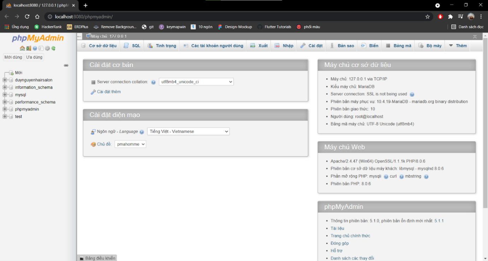

Hình 1.6. Màn hình phpMyAdmin

# Thiết kế hệ thống

Chương này sẽ trình bày về quá trình khảo sát các ứng dụng tương tự, khảo sát yêu cầu, thói quen sử dụng của người dùng trong thực tế. Khảo sát các vấn đề thực tế của một của chuỗi, một tiệm cắt tóc nam. Từ những khảo sát đó đi tới thiết kế hệ thống sao cho hợp lí nhất

1.  
2.  

## Thiết kế hệ thông

### Bài toán đặt ra

1.  Là sao để khách hàng biết được ngày … tại cơ sở … có nhân viên nào đi làm?

**Giải**: theo quy trình, khách sẽ phải chọn cơ sở chọn dịch vụ muốn sử dụng chọn ngày chọn nhân viên chọn khung giờ.

Tại bước chọn ngày, ứng dụng sẽ kiểm tra trên hệ thống, đối chiếu với lịch làm việc của nhân viên đã đăng kí mỗi cuối tuần. Phía server sẽ trả về những nhân viên có đi làm và hiển thị lên. Còn nếu nhân viên đó không đi làm sẽ không hiển thị. Khách hàng có thể chọn sang ngày khác.

1.  Làm sao để khách hàng biết chính xác mình cần trả bao nhiêu tiền, tránh việc nhân viên thu quá số tiền?

**Giải:** Giá của các dịch vụ đã được công khai trên ứng dụng nên khách hàng có thể đối chiếu. Hoặc sau khi đặt khách hàng vẫn có thể xem lại toàn bộ thông tin lịch đã đặt.

1.  Làm sao để huỷ lịch?

**Giải:** Sau khi đặt khách hàng có thể vào trong màn hình history để xem. Lịch hẹn gần nhất sẽ hiện ở đầu tiên và sẽ khác với các lịch đã hoàn là có thêm nút huỷ lịch.

1.  Làm sao để hạn chế người dùng ảo?

**Giải:** Vấn đề này tạm thời sẽ sử lí bằng việc yêu cầu khách hàng đăng nhập bằng số điện thoại đã được xác minh.

1.  Làm sao để biết tìm cơ sở gần nhất?

**Giải:** Khi khách hành đi tới màn hình chọn cơ sở thì hệ thống sẽ xin quyền người dùng cho phép sử dụng định vị để tính toán khoảng cách và đề xuất vị trí gần nhất ở vị trí đầu tiên trong danh sách.

### Quy trình nghiệp vụ

1.  Sơ đồ phân làn đặt lịch sử dụng dịch vụ

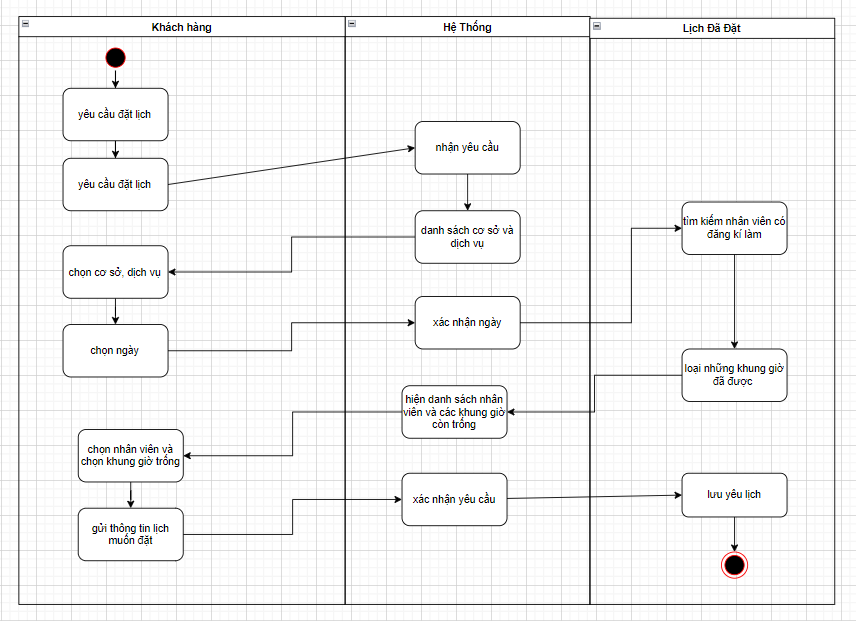

Hình 2.1. Sơ đồ phân làn quy trình đặt lịch

1.  Sơ đồ phân làn quy trình tạo hoá đơn

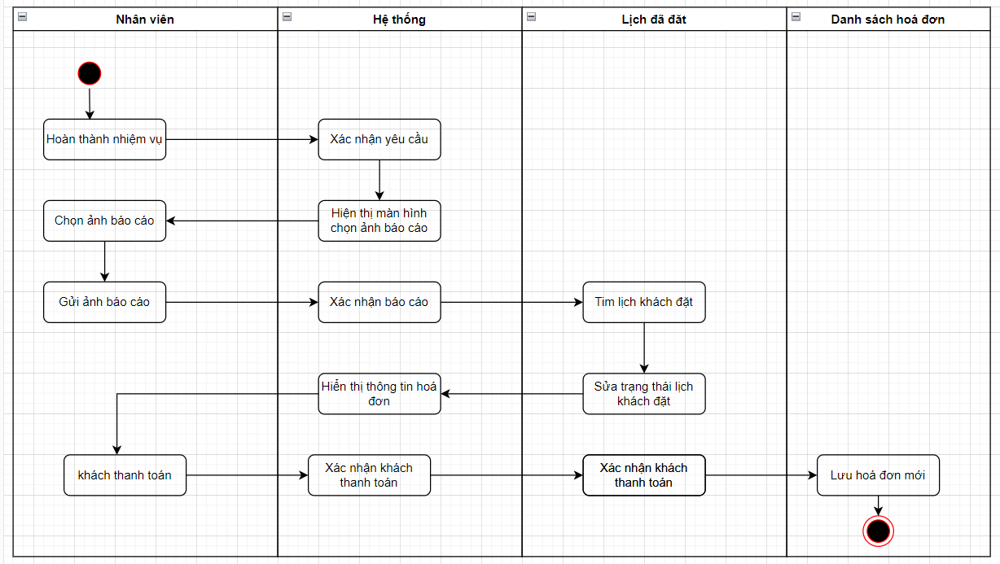

Hình 2.2. Sơ đồ phân làn quy trình tạo hoá đơn

### Mô hình use case

1.  Sơ đồ use case tổng quan

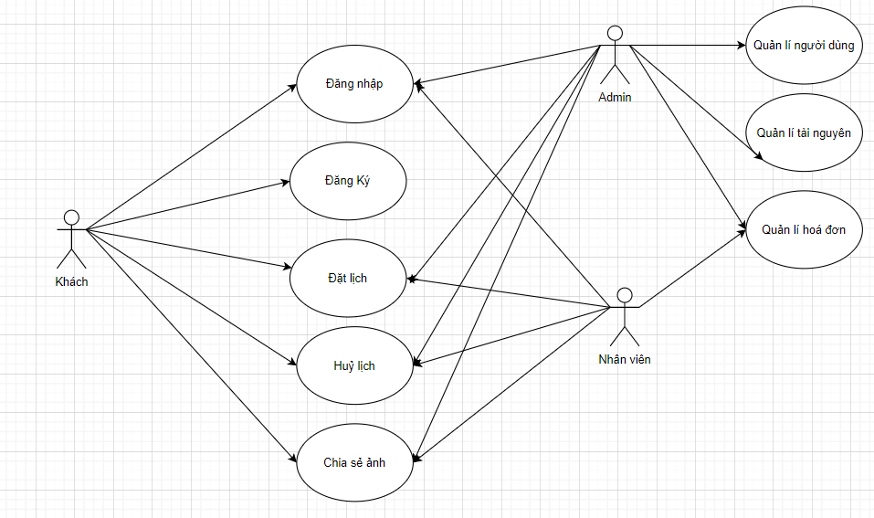

Hình 2.3. Sơ đồ use case tổng quan

1.  Sơ đồ use case người dùng cơ bản

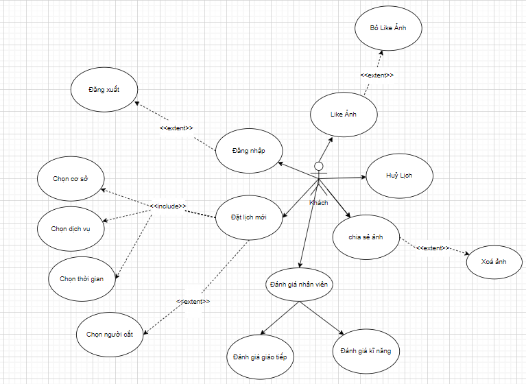

Hình 2.4. Sơ đồ use case người dùng cơ bản

1.  Sơ đồ use case quản trị hệ thống

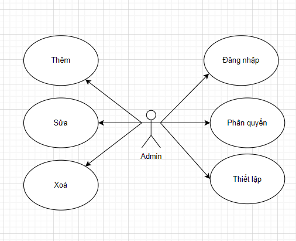

Hình 2.5. Sơ đồ use case quản trị hệ thống

1.  Sơ đồ use case quản lí lịch

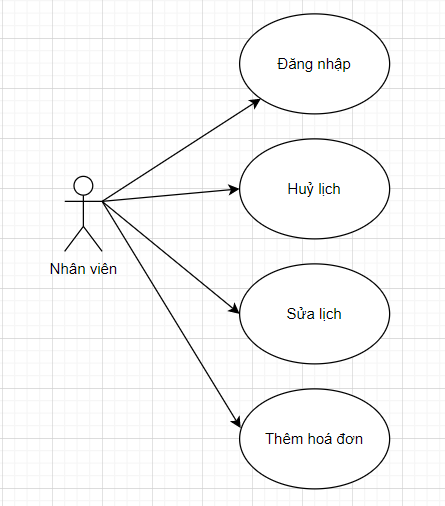

Hình 2.6. Sơ đồ use case quản lí lịch

### Danh sách tác nhân

Các tác nhân gồm có: người quản trị hệ thống (tạm gọi là Admin), nhân viên, người dùng thông thường (tạm gọi là khách).

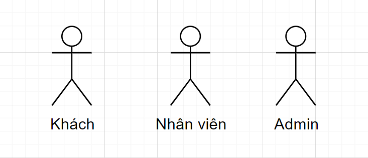

Hình 2.7. Danh sách các tác nhân

### Danh sách use case và mô tả

**Bảng 2.1.** Danh sách use case và mô tả

| ID   | Tên Use case       | Mô tả ngắn gọn  Use case                                 | Chức năng                                                         |
|------|--------------------|----------------------------------------------------------|-------------------------------------------------------------------|
| UC_1 | Quản lý người dùng |                                                          | Đăng kí Đăng nhập Đăng xuất Quên mật khẩu                         |
| UC_2 | Quản lý đặt lịch   |                                                          | Tạo lịch sử dụng dịch vụ Huỷ lịch Xem lại lịch sử đặt lịch        |
| UC_3 | Đánh giá nhân viên | Người dùng đánh giá sau khi đã sử dụng dịch vụ           | Đánh giá kĩ năng giao tiếp. Đánh giá kĩ năng chuyên môn           |
| UC_4 | Quản lý bài đăng   | Bài đăng bao gồm ảnh chụp khách sau khi nhân viên báo có | Đăng bài Xem tất cả bài trong tháng Like bài đăng Bỏ like Xoá bài |
| UC_5 | Quản lý hoá đơn    |                                                          | Tạo hoá đơn mới Thống kê doanh thu cuối ngày                      |

Trong đó:

UC: Quy cách đánh số Use case

1, 2, 3: là số thứ tự của use case

### Đặc tả các yêu cầu chức năng

1.  Đặc tả use case đăng nhập

**Bảng 2.2.** Đặc tả use case đăng nhập

| Use case: UC_1_Đăng nhập  |                                                                                                                                                                                                                                                                    |
|---------------------------|--------------------------------------------------------------------------------------------------------------------------------------------------------------------------------------------------------------------------------------------------------------------|
| Mục đích:                 | Đăng nhập vào hệ thống để thao tác với ứng dụng                                                                                                                                                                                                                    |
| Mô tả:                    | Người dùng nhsố điện thoại, mật khẩu hoặc đăng nhập bằng Google, Facbook vào hệ thống để hệ thống kiểm tra                                                                                                                                                         |
| Tác nhân:                 | Khách, Nhân viên, Admin                                                                                                                                                                                                                                            |
| Điều kiện trước:          | Người dùng nhập tài khoản mật khẩu                                                                                                                                                                                                                                 |
| Luồng sự kiện chính       | Hệ thống hiển thị trang “đăng nhập” bao gồm các text tên đăng nhập, mật khẩu. Tác nhân chọn đăng nhập bằng Google hoặc Facebook.  Tác nhân nhấn nút “Đăng nhập”.  Hệ thống kiểm tra thông tin đăng nhập.  Hệ thống điều hướng tới màn hình chính Use case kết thúc |
| Luồng sự kiện phụ         | Nếu tại dòng sự kiện chính số 2 tác nhân không cho phép sử dụng tài khoản từ nền tảng mạng xã hội khác.  Nếu tại dòng sự kiện chính số 4 hệ thống kiểm tra thông tin đăng nhập không hợp lệ, hệ thống thông báo lỗi.  Usecase kết thúc.                            |
| Điều kiện sau:            | Người đăng nhập đã có tài khoản trong hệ thống                                                                                                                                                                                                                     |

-   Biểu đồ trình tự

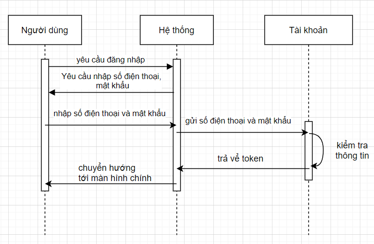

Hình 2.8. Biểu đồ trình tự use case đăng nhập

1.  Đặc tả use case đăng kí

**Bảng 2.3.** Đặc tả use case đăng kí

| Use case: UC_1_Đăng kí |                                                                                                                                                                          |
|------------------------|--------------------------------------------------------------------------------------------------------------------------------------------------------------------------|
| Mục đích:              | Tạo tài khoản đăng nhập vào hệ thống để thao tác với ứng dụng                                                                                                            |
| Mô tả:                 | Khi người dùng chưa có tài khoản đăng nhập                                                                                                                               |
| Tác nhân:              | Khách                                                                                                                                                                    |
| Điều kiện trước:       | Nhập đủ thông tin                                                                                                                                                        |
| Luồng sự kiện chính    | Hệ thống hiển thị form đăng kí Người dùng nhập đầu đủ thông tin Người dùng gửi thông tin Hệ thống kiểm tra thông tin Hệ thống điều hướng tới đăng nhập Kểt thúc use case |
| Luồng sự kiện phụ      | Nếu tại dòng sự kiện chính số 2 nhấn “Back” Nếu tại dòng sự kiện chính số 4 thông tin đăng kí sai thì hiện thông báo Usecase kết thúc.                                   |
| Điều kiện sau:         | Người dùng tạo được tài khoản trong hệ thống                                                                                                                             |

-   Biểu đồ trình tự

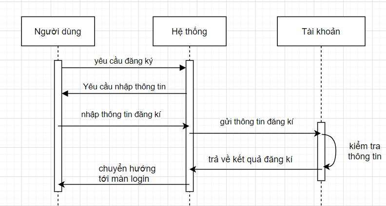

Hình 2.9. Biểu đồ trình tự use case đăng kí

1.  Đặc tả use case đăng xuất

**Bảng 2.4.** Đặc tả use case đăng xuất

| Use case: UC_1_Đăng xuất |                                                                                                                                                 |
|--------------------------|-------------------------------------------------------------------------------------------------------------------------------------------------|
| Mục đích:                | Đăng xuất ra khỏi ứng dụng, đổi tài khoản khác                                                                                                  |
| Mô tả:                   | Người dụng nhấn nút đăng xuất                                                                                                                   |
| Tác nhân:                | Khách, Admin, Nhân viên                                                                                                                         |
| Điều kiện trước:         | Đã đăng nhập trong ứng dụng                                                                                                                     |
| Luồng sự kiện chính:     | Người dùng yêu cầu đăng xuất Kiểm tra token Hệ thống thực hiện đăng xuất Hệ thống điều hướng người dùng về màn hình đăng nhập Kểt thúc use case |
| Luồng sự kiện phụ :      | Không có                                                                                                                                        |
| Điều kiện sau:           | Không có                                                                                                                                        |

1.  Đặc tả use case quên mật khẩu

**Bảng 2.5.** Đặc tả use case quên mật khẩu

| Use case: UC_1_Quên mật khẩu  |                                                                                                                                                                                                                                                                                                                                                                                                   |
|-------------------------------|---------------------------------------------------------------------------------------------------------------------------------------------------------------------------------------------------------------------------------------------------------------------------------------------------------------------------------------------------------------------------------------------------|
| Mục đích:                     | Đặt lại mật khẩu khi khách hàng quên mật khẩu                                                                                                                                                                                                                                                                                                                                                     |
| Mô tả:                        | Người dùng nhấn nút quên mật khẩu                                                                                                                                                                                                                                                                                                                                                                 |
| Tác nhân:                     | Khách, Admin, Nhân viên                                                                                                                                                                                                                                                                                                                                                                           |
| Điều kiện trước:              | Đã có tài khoản trên hệ thống                                                                                                                                                                                                                                                                                                                                                                     |
| Luồng sự kiện chính:          | Người dùng yêu cầu đặt lại mật khẩu Hệ thống yêu cầu nhập số điện thoại Người dùng nhập số điện thoại Hệ thống kiểm tra và gửi mã xác thực về số điện thoại Hệ thống yêu cầu nhập lại mã xác thực Người dùng nhập lại mã xác thực Hệ thống kiểm tra và yêu cầu nhập mật khẩu mới Người dùng nhập mật khẩu mới Hệ thống lưu lại mật khẩu mới và điều hướng về màn hình đăng nhập Kểt thúc use case |
| Luồng sự kiện phụ :           | Nếu tại luồng sự kiện chính số 7 người dùng nhập sai mã xác thực thì hệ thống sẽ báo lỗi và yêu cầu nhập lại                                                                                                                                                                                                                                                                                      |
| Điều kiện sau:                | Đổi mật khẩu thành công                                                                                                                                                                                                                                                                                                                                                                           |

-   Biểu đồ trình tự

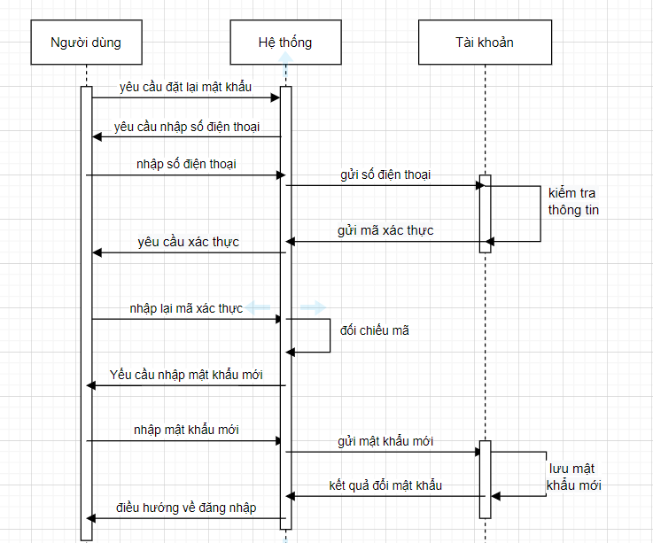

Hình 2.10. Biểu đồ trình tự use case quên mật khâu

1.  Đặc tả use case tạo lịch sử dụng dịch vụ

| Use case: UC_2\_ Tạo lịch sử dụng dịch vụ |                                                                                                                                                                                                                                                                                                                                                                                                                                                                               |
|-------------------------------------------|-------------------------------------------------------------------------------------------------------------------------------------------------------------------------------------------------------------------------------------------------------------------------------------------------------------------------------------------------------------------------------------------------------------------------------------------------------------------------------|
| Mục đích:                                 | Tạo lịch sử dụng dịch vụ (tạo lịch hẹn)                                                                                                                                                                                                                                                                                                                                                                                                                                       |
| Mô tả:                                    | Khi người dùng muốn đặt lịch cắt tóc, có thể là khách hoặc nhân viên đặt hộ khách                                                                                                                                                                                                                                                                                                                                                                                             |
| Tác nhân:                                 | Khách, Admin, Nhân viên                                                                                                                                                                                                                                                                                                                                                                                                                                                       |
| Điều kiện trước:                          | Đã có tài khoản trên hệ thống                                                                                                                                                                                                                                                                                                                                                                                                                                                 |
| Luồng sự kiện chính:                      | Người dùng yêu cầu đặt lịch Hệ thống yêu cầu chọn cơ sở và dịch vụ Người dùng chọn cơ sở và dịch vụ Hệ thống kiểm tra và tìm toàn bộ nhân viên có làm việc tại cửa hàng Hệ thống hiển thị nhân viên và yêu cầu chọn nhân viên Người dùng chọn nhân viên Hệ thống kiểm tra những lịch đã bị người khác đặt trước đó của nhân viên mà người dùng hiện đang muốn chọn. Người dùng chọn ngày giờ phù hơp Hệ thống tạo lịch hẹn mới Hiển thị thông tin lịch hẹn. Kểt thúc use case |
| Luồng sự kiện phụ :                       | Nếu tại luồng sự kiện chính số 2 người dùng bấm huỷ Nếu tại luồng sự kiện chính số 5 người dùng bấm huỷ thì quy lại luồng chính 2 tương tự tại luồng 7 thì qua lại luồng 5. Kết thúc use case                                                                                                                                                                                                                                                                                 |
| Điều kiện sau:                            | Tạo lịch hẹn thành công                                                                                                                                                                                                                                                                                                                                                                                                                                                       |

-   Biểu đồ trình tự

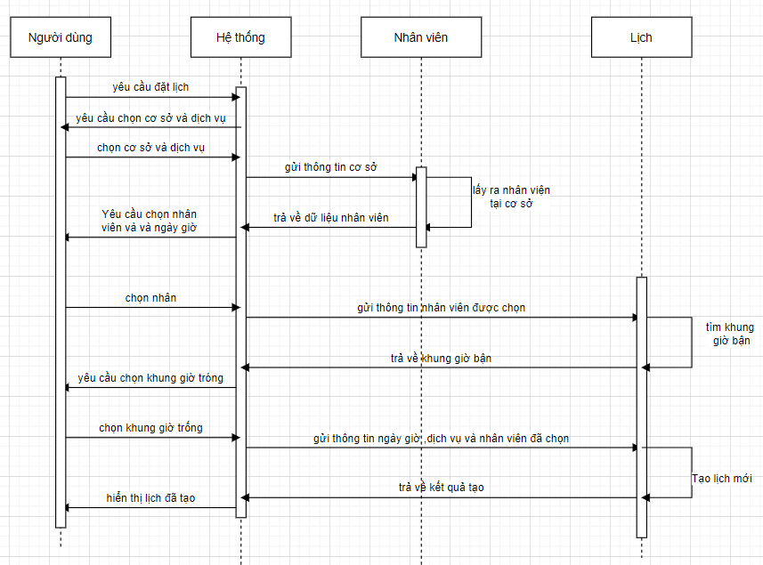

Hình 2.11. Biểu đồ trình tự use case tạo lịch sử dụng dịch vụ

1.  Đặc tả use case huỷ lịch

| Use case: UC_2\_ Huỷ lịch |                                                                                                                               |
|---------------------------|-------------------------------------------------------------------------------------------------------------------------------|
| Mục đích:                 | Người dùng muốn huỷ lịch hẹn, thay đổi lịch hẹn                                                                               |
| Mô tả:                    | Khi người dùng muốn thay đổi lịch hẹn hoặc huỷ hẳn lịch hoặc khách đến trễ                                                    |
| Tác nhân:                 | Khách, Admin, Nhân viên                                                                                                       |
| Điều kiện trước:          | Đã có tài khoản trên hệ thống và đã có lịch hẹn                                                                               |
| Luồng sự kiện chính:      | Người dùng yêu cầu huỷ lịch Hệ thống yêu cầu xác nhận lại yêu cầu Người dùng xác nhận Hệ thống xoá lịch hẹn Kểt thúc use case |
| Luồng sự kiện phụ :       | Không có                                                                                                                      |
| Điều kiện sau:            | Huỷ lịch thành công                                                                                                           |

-   Biểu đồ trình tự

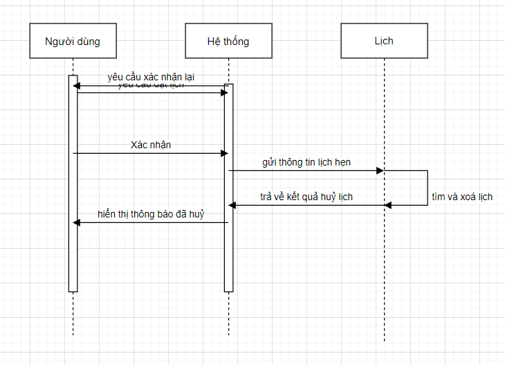

Hình 2.12. Biểu đồ trình tự use case huỷ lịch sử dụng dịch vụ

1.  Đặc tả use case xem lịch sử lịch hẹn

**Bảng 2.5.** Đặc tả use case xem lịch sử lịch hẹn

| Use case: UC_2\_ Xem lịch sử lịch hẹn |                                                                                                                               |
|---------------------------------------|-------------------------------------------------------------------------------------------------------------------------------|
| Mục đích:                             | Xem lại các lịch đã đặt, lịch đã kết thúc                                                                                     |
| Mô tả:                                | Khi người dùng muỗn xem lại những lần đặt lịch                                                                                |
| Tác nhân:                             | Khách, Admin, Nhân viên                                                                                                       |
| Điều kiện trước:                      | Đã có tài khoản trên hệ thống                                                                                                 |
| Luồng sự kiện chính:                  | Người dùng yêu cầu xem lại lịch sử đặt Hệ thống tìm kiếm toàn bộ lịch  Hệ thống hiển thị lên cho người dùng Kểt thúc use case |
| Luồng sự kiện phụ :                   | Không có                                                                                                                      |
| Điều kiện sau:                        | Không có                                                                                                                      |

1.  Đặc tả use case đánh giá nhân viên

**Bảng 2.6.** Đặc tả use case đánh giá nhân viên

| Use case: UC_3\_ Đánh giá nhân viên |                                                                                                                                                                                           |
|-------------------------------------|-------------------------------------------------------------------------------------------------------------------------------------------------------------------------------------------|
| Mục đích:                           | Đánh giá chất lượng phục vụ                                                                                                                                                               |
| Mô tả:                              | Khi khách hàng sử dụng xong dịch vụ, sau thanh toán khách hàng sẽ đánh giá nhân viên về kĩ năng giao tiếp và kĩ năng chuyên môn trên thang điểm 5                                         |
| Tác nhân:                           | Khách                                                                                                                                                                                     |
| Điều kiện trước:                    | Đã có tài khoản trên hệ thống, đã có hoá đơn dựa trên lịch đã đặt                                                                                                                         |
| Luồng sự kiện chính:                | Người dùng yêu cầu đánh giá nhân viên Hệ thống yêu cầu người dùng cho điểm Người dùng cho điểm Hệ thống lưu lại điểm Hệ thống hiển thị thông báo về trạng thái đánh gái Kết thúc use case |
| Luồng sự kiện phụ :                 | Không có                                                                                                                                                                                  |
| Điều kiện sau:                      | Đánh giá nhân viên thành công                                                                                                                                                             |

1.  Đặc tả use case đăng bài

**Bảng 2.7.** Đặc tả use case đăng bài

| Use case: UC_4_Đăng bài |                                                                                                                                                                                                |
|-------------------------|------------------------------------------------------------------------------------------------------------------------------------------------------------------------------------------------|
| Mục đích:               | Tạo bài viết mới từ ảnh sau quá trình nhân viên phục vụ báo cáo hoà thành lịch hẹn                                                                                                             |
| Mô tả:                  | Sau khi khách hành tới và sử dụng dịch vụ theo lịch hẹn, kết thúc cuộc hẹn nhân viên sẽ chụp ảnh báo cáo cho cuộc hẹn đó và người dùng có thể chủ động dăng bài từ những ảnh đó lên cộng đồng. |
| Tác nhân:               | Khách                                                                                                                                                                                          |
| Điều kiện trước:        | Đã có tài khoản trên hệ thống, đã tới sử dụng dịch vụ                                                                                                                                          |
| Luồng sự kiện chính:    | Người dùng yêu cầu tạo bài viết Hệ thống hiển thị form bài viết Người dùng xác nhận đăng bài Hệ thống tạo bài viết Hệ thống hiển thị thông báo kết quả tạo bài viết Kểt thúc use case          |
| Luồng sự kiện phụ :     | Nếu tại luồng xử lí chính 2 người dùng bấm “Huỷ” thì kết thúc use case                                                                                                                         |
| Điều kiện sau:          | Tạo bài viết mới thành công                                                                                                                                                                    |

-   Biểu đồ trình tự

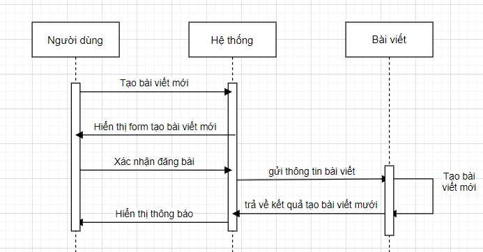

Hình 2.13. Biểu đồ trình tự use case tạo lịch sử dụng dịch vụ

1.  Đặc tả use case xem tất các bài viết trong tháng

**Bảng 2.8.** Mô tả use case xem tất các bài viết trong tháng

| Use case: UC_4\_ Xem tất các bài viết trong tháng |                                                                                                   |
|---------------------------------------------------|---------------------------------------------------------------------------------------------------|
| Mục đích:                                         | Xem tất các bài viết trong tháng của tất cả mọi người                                             |
| Mô tả:                                            | Khi người dùng muốn xem các bài viết của mọi người khác                                           |
| Tác nhân:                                         | Khách, Admin, Nhân viên                                                                           |
| Điều kiện trước:                                  | Đã có tài khoản trên hệ thống                                                                     |
| Luồng sự kiện chính:                              | Người dùng yêu cầu xem bài viết Hệ thống tìm bài viết của mọi người trong tháng Kểt thúc use case |
| Luồng sự kiện phụ :                               | Không có                                                                                          |
| Điều kiện sau:                                    | Không có                                                                                          |

1.  Đặc tả use case like/unlike

**Bảng 2.9.** Mô tả use case like/unlike (tưởn tác với bài viết)

| Use case: UC_4\_ Like/Unlike |                                                                                                                                          |
|------------------------------|------------------------------------------------------------------------------------------------------------------------------------------|
| Mục đích:                    | Tạo tương tác với bài viết                                                                                                               |
| Mô tả:                       | Người dùng nhấn nút like                                                                                                                 |
| Tác nhân:                    | Khách, Admin, Nhân viên                                                                                                                  |
| Điều kiện trước:             | Đã có tài khoản trên hệ thống                                                                                                            |
| Luồng sự kiện chính:         | Người dùng nhấn like Hệ thống kiểm tra xem người dùng đã từng like chưa Trả về trạng thái đã like hoặc unlike(bỏ like) Kểt thúc use case |
| Luồng sự kiện phụ :          | Không có                                                                                                                                 |
| Điều kiện sau:               | Cập nhật số lượng like của bài viết                                                                                                      |

1.  Đặc tả use case xoá bài viết

**Bảng 2.10.** Đặc tả use case xoá bài viết

| Use case: UC_4\_ Xoá bài |                                                                                                                                                |
|--------------------------|------------------------------------------------------------------------------------------------------------------------------------------------|
| Mục đích:                | Khách hàng không muốn công khai bài viết nữa                                                                                                   |
| Mô tả:                   | Khi người dùng không muốn bài viết mình đã đăng tồn tài                                                                                        |
| Tác nhân:                | Khách                                                                                                                                          |
| Điều kiện trước:         | Đã có tài khoản trên hệ thống, là chủ sở hưu bài đăng                                                                                          |
| Luồng sự kiện chính:     | Người dùng xoá bài viết Hệ thống yêu cầu người dùng xác nhận lại Hệ thống kiểm tra thông tin Hệ thống trả về kết quả xoá bài Kểt thúc use case |
| Luồng sự kiện phụ :      | Nếu tại luồng sự kiện chính 2 khách hàng nhấn “Huỷ” thì kết thúc use case                                                                      |
| Điều kiện sau:           | Xoá bài thành công                                                                                                                             |

1.  Đặc tả use case tạo hoá đơn mới

**Bảng 2.11.** Đặc tả use case tạo hoá đơn mới

| Use case: UC_5\_ Tạo hoá đơn |                                                                                                                                                                                                                                                        |
|------------------------------|--------------------------------------------------------------------------------------------------------------------------------------------------------------------------------------------------------------------------------------------------------|
| Mục đích:                    | Tạo hoá đơn mới                                                                                                                                                                                                                                        |
| Mô tả:                       | Sau khi khách hàng đã sử dụng xong dịch vụ nhân viên sẽ tạo hoá đơn                                                                                                                                                                                    |
| Tác nhân:                    | Nhân viên                                                                                                                                                                                                                                              |
| Điều kiện trước:             | Đã có tài khoản trên hệ thống, khách hàng đã sử dụng xong dịch vụ                                                                                                                                                                                      |
| Luồng sự kiện chính:         | Nhân viên yêu cầu tạo hoá đơn Hệ thống tìm lịch hẹn tương ứng trả về thông tin cần thanh toán Nhân viên xác nhận khách hàng đã thanh toán Hệ thống tạo hoá đơn từ thông tin lịch hẹn và sửa trạng thái của lịch hẹn là đã hoàn thành Kểt thúc use case |
| Luồng sự kiện phụ :          | Nếu tại luồng sự kiện chính 3 nhân viên chọn “Huỷ” thì kết thúc use case                                                                                                                                                                               |
| Điều kiện sau:               | Tạo hoá đơn mới                                                                                                                                                                                                                                        |

-   Biểu đồ trình tự

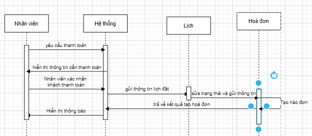

Hình 2.14. Biểu đồ trình tự use case tạo hoá đơn thanh toán

1.  Đặc tả use case thống kê cuối ngày

**Bảng 2.12.** Đặc tả use case thống kê cuối ngày

| Use case: UC_5\_ Thống kê cuối ngày |                                                                                                                                                                                                                        |
|-------------------------------------|------------------------------------------------------------------------------------------------------------------------------------------------------------------------------------------------------------------------|
| Mục đích:                           | Người quản lí cơ sở sẽ biết từng nhân viên thu của khách hàng tổng là bao nhiêu tiền                                                                                                                                   |
| Mô tả:                              | Cuối ngày nhân viên quản lí cơ sở sẽ xem toàn bộ tiền nhân viên trực tiếp phục vụ khách thu của khách là bao nhiêu để thu lại của nhân viên                                                                            |
| Tác nhân:                           | Nhân viên (Quản lí cơ sở)                                                                                                                                                                                              |
| Điều kiện trước:                    | Đã có tài khoản trên hệ thống, là quản lí cơ sở                                                                                                                                                                        |
| Luồng sự kiện chính:                | Nhân viên quản lí cơ sở yêu cầu thống kê Hệ thống tìm toàn bộ nhân viên cùng cơ sở với nhân viên quản lí và thống kê toàn bộ tiền từng nhân viên thu của khách theo từng nhân viên Xác nhận nộp tiền Kểt thúc use case |
| Luồng sự kiện phụ :                 | Không có                                                                                                                                                                                                               |
| Điều kiện sau:                      | Không có                                                                                                                                                                                                               |

1.  
2.  
    1.  

## Mô hình quan hệ thực thể

1.  **Mô tả bảng**

**Bảng 2.13.** Bảng users

| TT  | Tên cột       | Kiểu dữ liệu                               | Mô tả                                          |
|-----|---------------|--------------------------------------------|------------------------------------------------|
| 1   | id            | bigint(20)                                 | id                                             |
| 2   | name          | varchar(30)                                | Tên người dùng                                 |
| 3   | phone_number  | varchar(20)                                | Số điện thoại người dùng                       |
| 4   | email         | varchar(255)                               | Email người dùng                               |
| 5   | provider_id   | varchar(255)                               | Id gười dùng tại các nền tảng mạng xã hội khác |
| 6   | provider_type | enum(‘phone_number’, ‘facebook’, ‘google’) | Kiểu đăng nhập của người dùng                  |
| 7   | points        | int(11)                                    | Điểm tích luỹ                                  |
| 8   | status        | tinyint(1)                                 | Trạng thái hoạt động                           |
| 9   | avartar       | text                                       | Đường dẫn ảnh của người dùng                   |
| 10  | rank_id       | bigint(20)                                 | Id bậc xếp hạng của người dùng                 |
| 11  | created_at    | timestamp                                  | thời gian tạo                                  |
| 12  | updated_at    | timestamp                                  | thời gian cập nhật                             |
| 13  | created_by    | bigint(20)                                 | id của người tạo                               |

**Bảng 2.14.** Bảng ranks

| TT  | Tên cột    | Kiểu dữ liệu  | Mô tả                       |
|-----|------------|---------------|-----------------------------|
| 1   | id         | bigint(20)    | id                          |
| 2   | rank_name  | varchar(100)  | Tên bậc xếp hạng            |
| 3   | threshold  | int(11)       | Ngưỡng điểm tích luỹ cần có |
| 4   | created_at | timestamp     | thời gian tạo               |
| 5   | updated_at | timestamp     | thời gian cập nhật          |
| 6   | created_by | bigint(20)    | id của người tạo            |

**Bảng 2.15.** Bảng bills

| TT  | Tên cột     | Kiểu dữ liệu  | Mô tả                         |
|-----|-------------|---------------|-------------------------------|
| 1   | id          | bigint(20)    | id                            |
| 2   | total       | double(8,2)   | Tổng tiền đã bao gồm giảm giá |
| 3   | task_id     | bigint(10)    | Id của nhiệm vụ               |
| 4   | discount_id | bigint(20)    | Id của mã giảm giá            |
| 5   | created_at  | timestamp     | thời gian tạo                 |
| 6   | updated_at  | timestamp     | thời gian cập nhật            |
| 7   | created_by  | bigint(20)    | id của người tạo              |

**Bảng 2.16.** Bảng calendars

| TT  | Tên cột            | Kiểu dữ liệu  | Mô tả                                       |
|-----|--------------------|---------------|---------------------------------------------|
| 1   | id                 | bigint(20)    | id                                          |
| 2   | scheduled_start_at | datetime      | Thời gian đăng kí lịch bắt đầu ca làm việc  |
| 3   | scheduled_end_at   | datetime      | Thời gian đăng kí lịch kết thúc ca làm việc |
| 4   | created_at         | timestamp     | thời gian tạo                               |
| 5   | updated_at         | timestamp     | thời gian cập nhật                          |
| 6   | created_by         | bigint(20)    | id của người tạo                            |

**Bảng 2.17.** Bảng calender_stylist

| TT  | Tên cột      | Kiểu dữ liệu  | Mô tả                              |
|-----|--------------|---------------|------------------------------------|
| 1   | stylist_id   | bigint(20)    | id nhân viên cắt tóc               |
| 2   | calendar_id  | bigint(20)    | Id của lịch làm việc của nhân viên |
| 3   | check_in_at  | datetime      | Giờ nhân viên báo vào ca làm việc  |
| 4   | check_out_at | datetime      | Giờ nhân viên báo hết ca làm việc  |
| 5   | created_at   | timestamp     | thời gian tạo                      |
| 6   | updated_at   | timestamp     | thời gian cập nhật                 |
| 7   | created_by   | bigint(20)    | id của người tạo                   |

**Bảng 2.18.** Bảng discounts

| TT  | Tên cột     | Kiểu dữ liệu  | Mô tả                         |
|-----|-------------|---------------|-------------------------------|
| 1   | id          | bigint(20)    | id                            |
| 2   | code        | varchar(30)   | Mã giảm giá công khai         |
| 3   | name        | varchar(30)   | Tên mã giảm giá               |
| 4   | description | text          | Mô tả chi tiết về mã giảm giá |
| 5   | reduction   | double(8,2)   | % giảm giá khi sử dụng mã     |
| 6   | created_at  | timestamp     | thời gian tạo                 |
| 7   | updated_at  | timestamp     | thời gian cập nhật            |
| 8   | created_by  | bigint(20)    | id của người tạo              |

**Bảng 2.19.** Bảng Facilities

| TT  | Tên cột     | Kiểu dữ liệu  | Mô tả                        |
|-----|-------------|---------------|------------------------------|
| 1   | id          | bigint(20)    | id                           |
| 2   | address     | varchar(100)  | Địa chỉ của cơ sở            |
| 3   | description | varchar(255)  | Mô tả vị trí xung quanh tiệm |
| 4   | logitude    | double(30,2)  | Kinh độ                      |
| 5   | latitude    | double(30,2)  | Vĩ độ                        |
| 6   | image       | text          | Đường dẫn ảnh chụp cơ sở     |
| 7   | created_at  | timestamp     | thời gian tạo                |
| 8   | updated_at  | timestamp     | thời gian cập nhật           |
| 9   | created_by  | bigint(20)    | id của người tạo             |

**Bảng 2.20.** Bảng imgae_products

| TT  | Tên cột    | Kiểu dữ liệu  | Mô tả                  |
|-----|------------|---------------|------------------------|
| 1   | id         | bigint(20)    | Id                     |
| 2   | link       | text          | Đường dẫn ảnh sản phẩm |
| 3   | product_id | bigint(20)    | Id sản phẩm            |
| 4   | created_at | timestamp     | thời gian tạo          |
| 5   | updated_at | timestamp     | thời gian cập nhật     |
| 6   | created_by | bigint(20)    | id của người tạo       |

**Bảng 2.21.** Bảng image_tasks

| TT  | Tên cột    | Kiểu dữ liệu  | Mô tả                              |
|-----|------------|---------------|------------------------------------|
| 1   | Id         | bigint(20)    | id                                 |
| 2   | link       | text          | Đường dẫn ảnh báo cáo của nhiệm vụ |
| 3   | task_id    | bigint(20)    | Id nhiệm vụ                        |
| 4   | created_at | timestamp     | thời gian tạo                      |
| 5   | updated_at | timestamp     | thời gian cập nhật                 |
| 6   | created_by | bigint(20)    | id của người tạo                   |

**Bảng 2.22.** Bảng likes

| TT  | Tên cột    | Kiểu dữ liệu  | Mô tả              |
|-----|------------|---------------|--------------------|
| 1   | post_id    | bigint(20)    | Id bài đăng        |
| 2   | user_id    | bigint(20)    | Id người dùng      |
| 3   | created_at | timestamp     | thời gian tạo      |
| 4   | updated_at | timestamp     | thời gian cập nhật |
| 5   | created_by | bigint(20)    | id của người tạo   |

**Bảng 2.23.** Bảng model_has_permissions

| TT  | Tên cột       | Kiểu dữ liệu  | Mô tả      |
|-----|---------------|---------------|------------|
| 1   | permission_id | bigint(20)    | Id quyền   |
| 2   | model_type    | varchar(255)  | Kiểu model |
| 3   | model_id      | bigint(20)    | Id model   |

**Bảng 2.24.** Bảng model_has_roles

| TT  | Tên cột    | Kiểu dữ liệu  | Mô tả      |
|-----|------------|---------------|------------|
| 1   | role_id    | bigint(20)    | Id vai trò |
| 2   | model_type | varchar(250)  | Kiểu model |
| 3   | model_id   | bigint(20)    | Id model   |

**Bảng 2.25.** Bảng permissions

| TT  | Tên cột    | Kiểu dữ liệu  | Mô tả                  |
|-----|------------|---------------|------------------------|
| 1   | id         | bigint (20)   | id                     |
| 2   | name       | varchar(255)  | Tên quyền              |
| 3   | guard_name | varchar(255)  | Tên hiển thị của quyền |
| 4   | created_at | timestamp     | thời gian tạo          |
| 5   | updated_at | timestamp     | thời gian cập nhật     |

**Bảng 2.26.** Bảng posts

| TT  | Tên cột    | Kiểu dữ liệu  | Mô tả                                 |
|-----|------------|---------------|---------------------------------------|
| 1   | id         | bigint(20)    | Id                                    |
| 2   | captions   | varchar(250)  | Chú thích ảnh                         |
| 3   | like_count | int(11)       | Số lượng người yêu thích bài viêt này |
| 4   | public_at  | datetime      | Thời gian được công khai              |
| 5   | delete_at  | datetime      | Thời gian xoá                         |
| 6   | task_id    | bigint(20)    | Id nhiệm vụ                           |
| 7   | created_at | timestamp     | thời gian tạo                         |
| 8   | updated_at | timestamp     | thời gian cập nhật                    |
| 9   | create_by  | bigint(20)    | Id người tạo                          |

**Bảng 2.27.** Bảng products

| TT  | Tên cột          | Kiểu dữ liệu  | Mô tả              |
|-----|------------------|---------------|--------------------|
| 1   | id               | bigint(20)    | Id                 |
| 2   | name             | varchar(255)  | tên                |
| 3   | duration         | int(11)       | Thời gian ước tính |
| 4   | price            | double(8,2)   | Giá dịch vụ        |
| 5   | sort_description | varchar(255)  | Mô tả ngắn gọn     |
| 6   | description      | text          | Mô tả chi tiết     |
| 7   | type_product_id  | bigint(20)    | Id loại dịch vụ    |
| 8   | created_at       | timestamp     | thời gian tạo      |
| 9   | updated_at       | timestamp     | thời gian cập nhật |
| 10  | create_by        | bigint(20)    | Id người tạo       |

**Bảng 2.28.** Bảng roles

| TT  | Tên cột    | Kiểu dữ liệu  | Mô tả                    |
|-----|------------|---------------|--------------------------|
| 1   | id         | bigint(20)    | Id                       |
| 2   | name       | varchar(255)  | Tên vai trò              |
| 3   | guard_name | varchar(255)  | Tên hiển thị của vai trò |
| 4   | created_at | timestamp     | thời gian tạo            |
| 5   | updated_at | timestamp     | thời gian cập nhật       |
| 6   | create_by  | bigint(20)    | Id người tạo             |

**Bảng 2.29.** Bảng role_has_permissions

| TT  | Tên cột       | Kiểu dữ liệu  | Mô tả          |
|-----|---------------|---------------|----------------|
| 1   | permission_id | bigint(20)    | Id của quyền   |
| 2   | role_id       | bigint(20)    | Id của vai trò |

**Bảng 2.30.** Bảng stylists

| TT  | Tên cột     | Kiểu dữ liệu  | Mô tả              |
|-----|-------------|---------------|--------------------|
| 1   | id          | bigint(20)    | Id                 |
| 2   | user_id     | bigint(20)    | Id người dùng      |
| 3   | facility_id | bigint(20)    | Id cơ sở           |
| 4   | created_at  | timestamp     | thời gian tạo      |
| 5   | updated_at  | timestamp     | thời gian cập nhật |
| 6   | create_by   | bigint(20)    | Id người tạo       |

**Bảng 2.31.** Bảng tasks

| TT  | Tên cột      | Kiểu dữ liệu  | Mô tả                                                    |
|-----|--------------|---------------|----------------------------------------------------------|
| 1   | id           | bigint(20)    | Id                                                       |
| 2   | status       | tinyint(1)    | Trạng thái nhiệm vụ là đã hoàn thành hay chưa hoàn thành |
| 3   | notes        | varchar(250)  | Ghi chú của khách                                        |
| 4   | date         | date          | Ngày hẹn lịch                                            |
| 5   | customer_id  | bigint(20)    | Id khách hàng(id user)                                   |
| 6   | stylist_id   | bigint(20)    | Id của nhân viên cắt tóc được khách hàng chọn            |
| 7   | time_slot_id | bigint(20)    |                                                          |
| 8   | created_at   | timestamp     | thời gian tạo                                            |
| 9   | updated_at   | timestamp     | thời gian cập nhật                                       |
| 10  | create_by    | bigint(20)    | Id người tạo                                             |

**Bảng 2.32.** Bảng task_products

| TT  | Tên cột    | Kiểu dữ liệu  | Mô tả              |
|-----|------------|---------------|--------------------|
| 1   | task_id    | bigint(20)    | Id nhiệm vụ        |
| 2   | product_id | bigint(20)    | Id sản phẩm        |
| 3   | created_at | timestamp     | thời gian tạo      |
| 4   | updated_at | timestamp     | thời gian cập nhật |
| 5   | create_by  | bigint(20)    | Id người tạo       |

**Bảng 2.33.** Bảng time_slots

| TT  | Tên cột    | Kiểu dữ liệu  | Mô tả              |
|-----|------------|---------------|--------------------|
| 1   | id         | bigint(20)    | Id                 |
| 2   | time       | time          | Mốc thời gian      |
| 3   | created_at | timestamp     | thời gian tạo      |
| 4   | updated_at | timestamp     | thời gian cập nhật |
| 5   | create_by  | bigint(20)    | Id người tạo       |

**Bảng 2.34.** Bảng type_products

| TT  | Tên cột    | Kiểu dữ liệu  | Mô tả              |
|-----|------------|---------------|--------------------|
| 1   | id         | bigint(20)    | id                 |
| 2   | name       | varchar(255)  | Tên loại dịch vụ   |
| 3   | created_at | timestamp     | thời gian tạo      |
| 4   | updated_at | timestamp     | thời gian cập nhật |
| 5   | create_by  | bigint(20)    | Id người tạo       |

### Sơ đồ phân rã chức năng

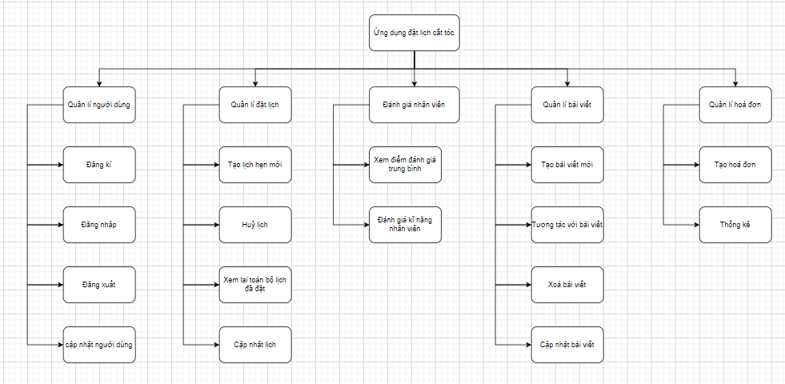

Hình 2.15. Sơ đồ phân rã chức năng

### Sơ đồ thực thể quan hệ

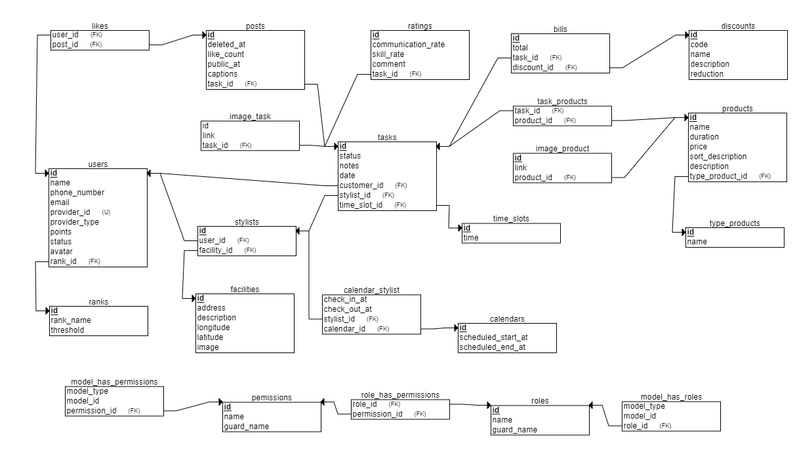

Hình 2.16. Sơ đồ thực thể quan hệ

### Biểu đồ lớp

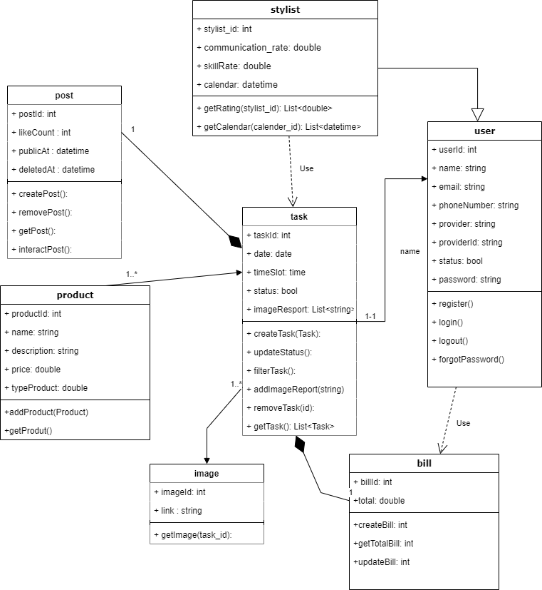

Hình 2.17. Biểu đồ lớp

# Cài đặt và thử nghiệm

Ở chương này sẽ trình bày về sản phẩm chạy thực tế

1.  

## Môi trường cài đặt

Do giới hạn về thiết bị sở hữu, em đang sử dụng laptop windows nên không thể test trên hệ điều hành iOS. Vì vậy môi trường cài đặt sẽ là Android.

## Giao diện và chức năng

### Chức năng đăng kí, đăng nhập, đăng xuất

Với chức năng đăng kí và đang nhập. Người dùng sẽ có 3 tùy chọn: đăng nhập với số điện thoại, đăng nhập với facebook, đăng nhập với google.

Ở tùy chọn đăng nhập bằng số điện thoại. Người dùng sẽ phải nhập số điện thoại của mình theo đúng định dạng. Nếu số điện thoại hợp lệ và đã đăng kí trước đó thì hệ thống sẽ điều hướng người dùng sang màn hình nhập mật khẩu. Ngược lại nếu số điện thoại này chưa tồn tại (chưa được đăng kí) thì hệ thống sẽ điều hướng người dùng sang màn hình đăng kí.

Tương tự với 2 tùy chọn đăng nhập với hai nền tảng mạng xã hội là facebook và google. Nếu thông tin lấy được từ việc chấp nhận đăng nhập bằng tài khoản mạng xã hội thì hệ thống sẽ kiểm tra xem thông tin đã tồn tại chưa nếu chưa thì sẽ lưu lại thông tin và cho phép đăng nhập ngay lập tức.

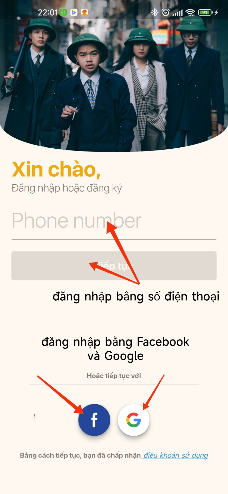

Hình 3.1. Các phương hình thức đăng nhập

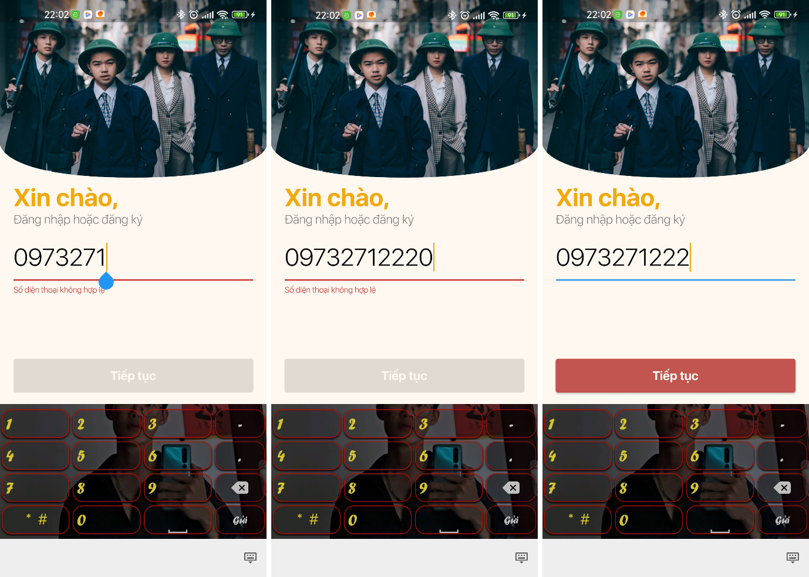

Hình 3.2. Validate số điện thoại

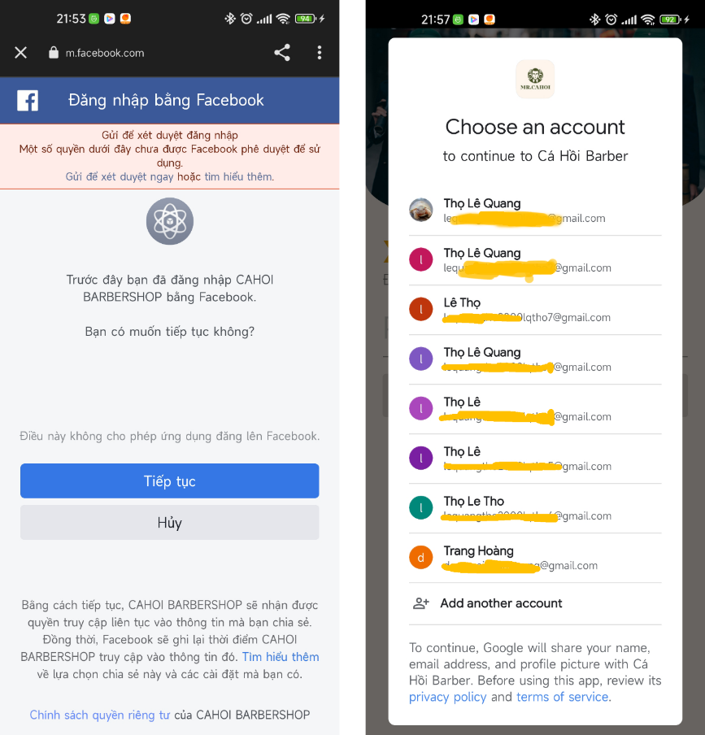

Hình 3.3. Lựa chọn đăng nhập với Facebook hoặc Google

Màn hình bên trái là trường hợp người dùng lần đầu tiên nhấn vào lựa chọn đăng nhập với Facebook. Tương tự với màn hình bên phải là lần đầu đăng nhập tài khoản Google trong ứng dụng.

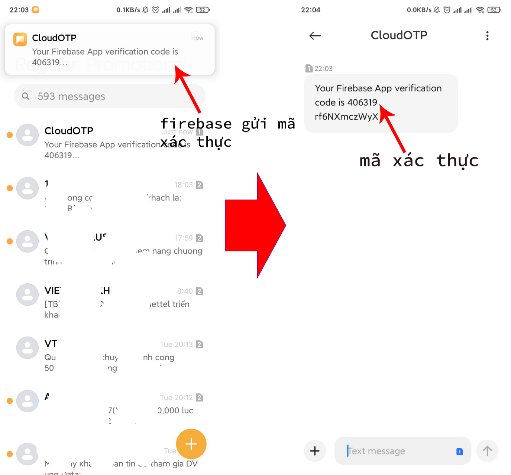

Hình 3.4. Hệ thống gửi mã xác thực về số điện thoại

Nếu số điện thoại chưa từng được sử dụng thì hệ thống sẽ gửi mã xác thực về số điện thoại và yêu cầu người dùng nhập lại mã xác thực đó.

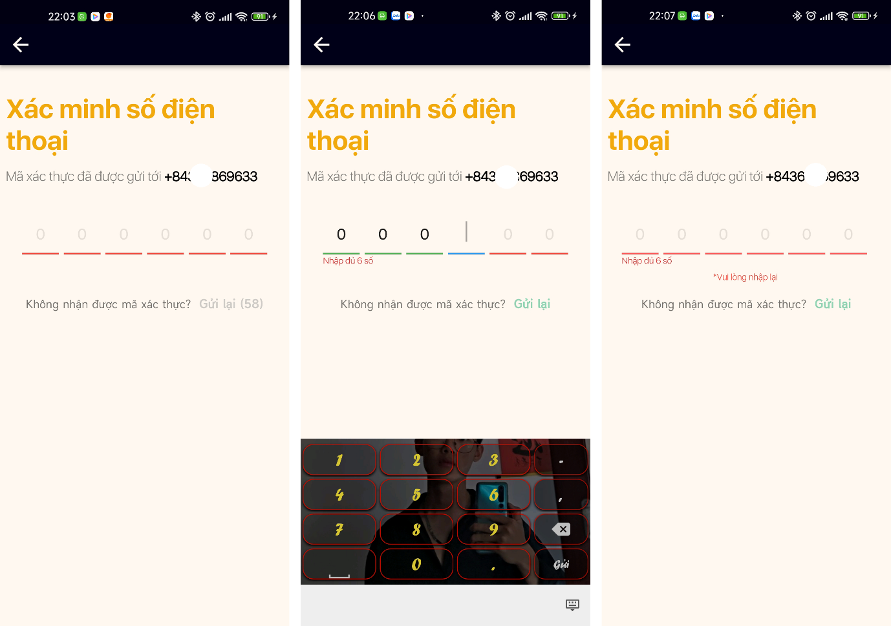

Hình 3.5. Yêu cầu người dùng nhập mã xác thực

Mã xác thực phải là một dãy gồm 6 chữ số. Người dùng chỉ cần nhập đủ 6 số thì hệ thống sẽ tự kiểm tra nếu sai sẽ xóa hết và yêu cầu nhập lại.

Ngược lại nếu nhập đúng thì sẽ được chuyển đến màn hình nhập thông tin: tên và mật khẩu.

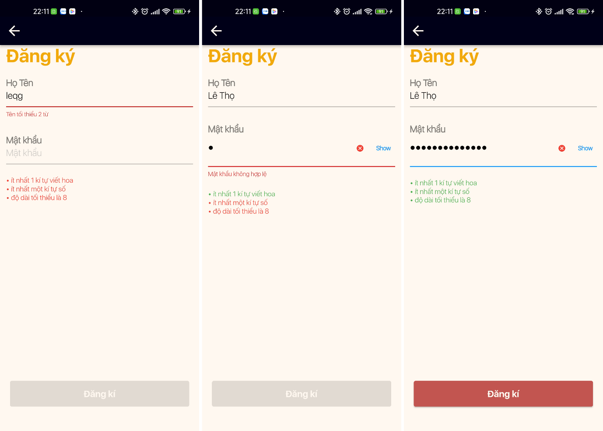

Hình 3.6. Màn hình đăng ký - validate tên và mật khẩu

Người dùng sẽ được yêu cầu nhập tên có tối thiểu 2 từ và mật khẩu cần tối thiểu 8 kí tự, tối tiểu 1 kĩ tự hoa và một kí tự đặc biệt.

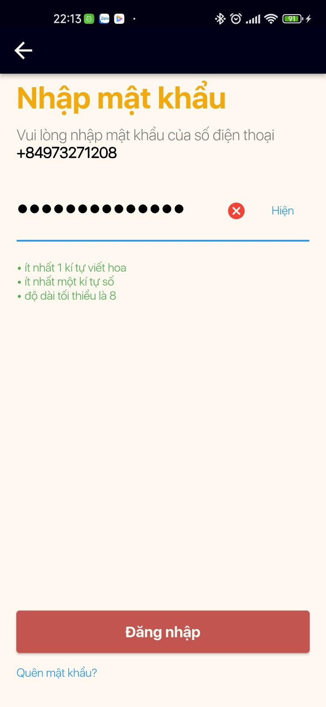

Hình 3.7. Màn hình nhập mật khẩu

Nếu đã có tài khooản tương ứng với số điện thoại thì sẽ được điều hướng tới màn hình nhập mật khẩu.

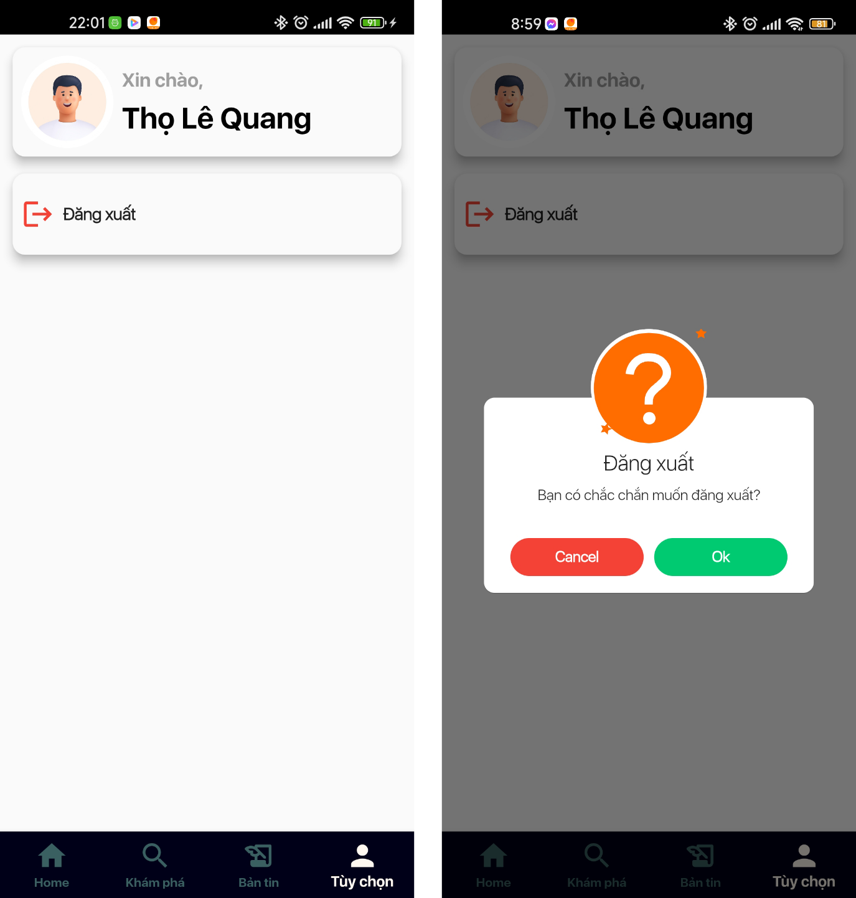

Hình 3.8. Màn hình đăng xuất

Khi người dùng nhấn đăng xuất, hệ thống sẽ yêu cầu xác nhận thêm một lần nữa. Nếu người dùng đồng ý thì sẽ được điều hướng tới màn hình đăng nhập.

### Chức năng đặt lịch cắt tóc

Ở chức năng này người dùng cần thực hiên theo từng bước. Sau khi đặt thành công người dùng có thể xem lại lịch đã đặt ở trong phần lịch sử.

Phần lịch sử sẽ bao gồm những lịch đã đặt nhưng chưa tới và những lần đã tới sử dụng dịch vụ trước đó.

Hình 3.9. Màn hình chính

Tại màn hình chính có thể thấy nút đặ lịch và nút lịch sử ở gần chính giữa màn hình.

Hình 3.10. Màn hình đặt lịch

Tại màn hình này, nếu người dùng trở lại trang trước thì cần phải nhấn vào biểu tượng hình ngôi nhà. Làm như vậy sẽ tránh trường hợp người dùng không mong muốn đóng màn hình và mất hết thông tin đã điền trước đó. Và trong ảnh 3.9 ta cũng thấy được quá trình đặt lịch gồm 3 bước chính.

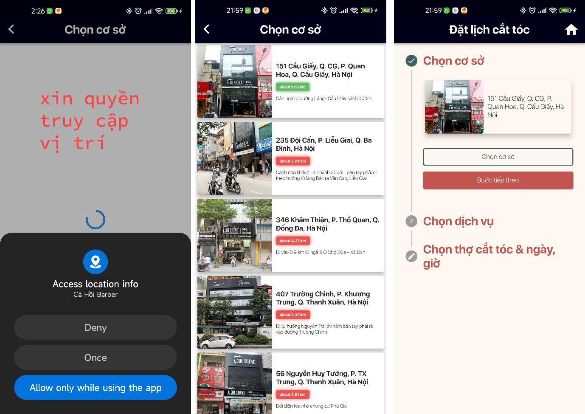

Hình 3.11. Chọn cơ sở muốn tới

Trước khi chọn vị trí hệ thống sẽ xin quyền truy cập vị trí để có thể tính toán, dự đoán khoảng cách tới cơ sở gần nhất. Sau khi chọn xong sẽ quay lại và tiếp tục các bước tiếp theo, điạ chỉ sẽ được hiển thị trên màn hình tại bước 1. Nếu thay đổi địa chỉ thì danh sách thợ cắt tóc cũng sẽ thay đổi theo ở bước 3.

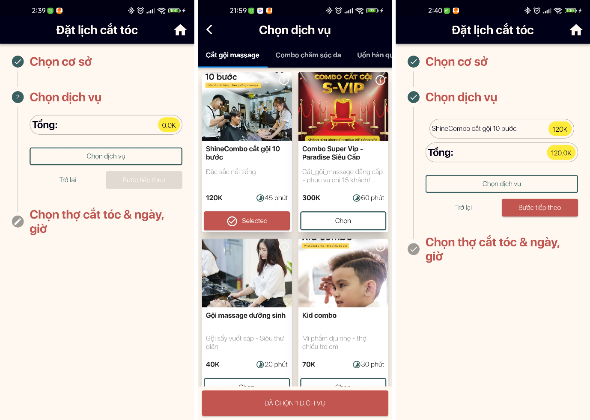

Hình 3.12. Lựa chọn dịch vụ mong muốn

Tương tự như chọn cơ sở, sau khi chọn dịch vụ người dùng cũng có thể nhìn thấy dịch vụ mà mình đã chọn và bao gồm cả số tiền sự kiến phải trả.

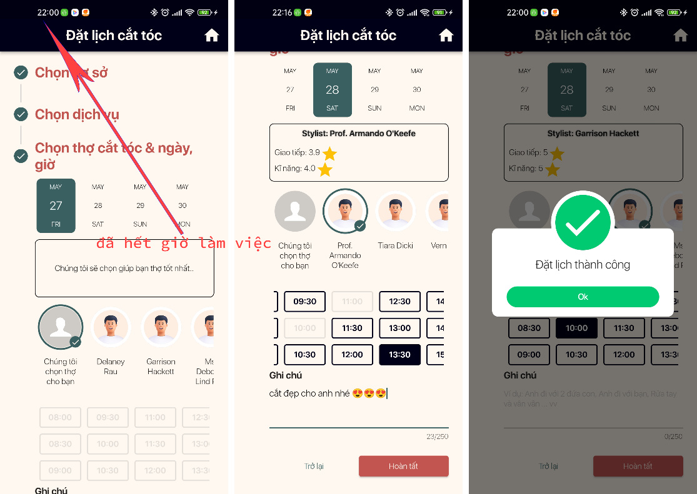

Hình 3.13. Chọn ngày, thợ cắt tóc và giờ

Ở bước này, nếu khách chọn à hôm nay nhưng quá giờ làm việc thì mọi slot giờ sẽ bị đóng (các nút không được chọn màu xám mờ). Tương tự với những khung giờ của thợ cắt tóc đã được đặt rồi cũng sẽ không thể chọn.

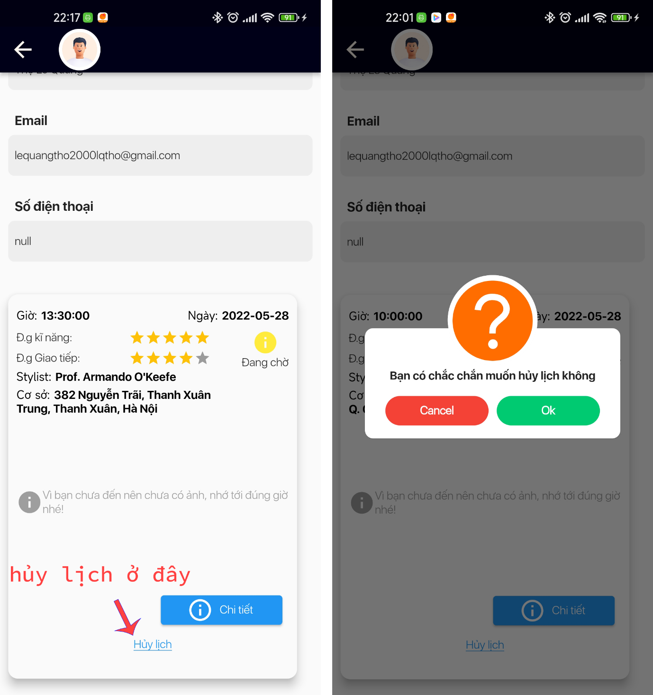

Hình 3.14. Thao tác hủy lịch

Hình trên là màn hình sau khi người dùng nhấn vào nút **lịch sử** từ màn hình chính. Nếu người dùng đổi ý không muốn đặt lịch hoặc muốn đổi lịch hẹn thì có thể hủy lịch. Việc hủy lịch sẽ không ảnh hưởng gì tới những chức năng khác nên trực tiếp sẽ xóa vĩnh viễn khỏi hệ thống.

### Chức năng báo cáo của thợ cắt tóc

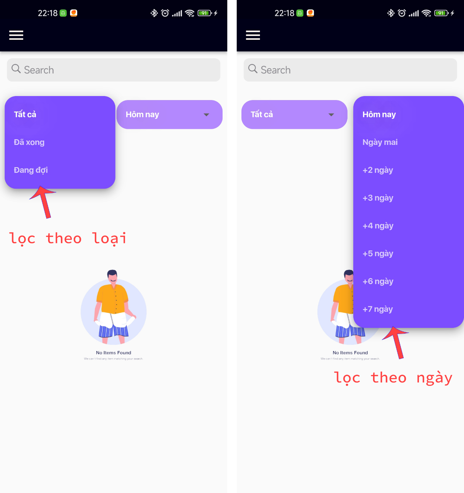

Hình 3.15. Màn hình chính của thợ cắt tóc

Đối với người dùng được phân quyền thợ cắt tóc thì sau khi đăng nhập thành công sẽ được điều hướng tới màn hình dành riêng cho thợ cắt tóc. Như hình ở trên, thợ cắt tóc có thể xem được những lịch được khách đặt. Có thể lọc theo ngày hoặc loại lịch (lịch đã hoàn thành, lịch chưa hoàn thành hoặc tất cả).

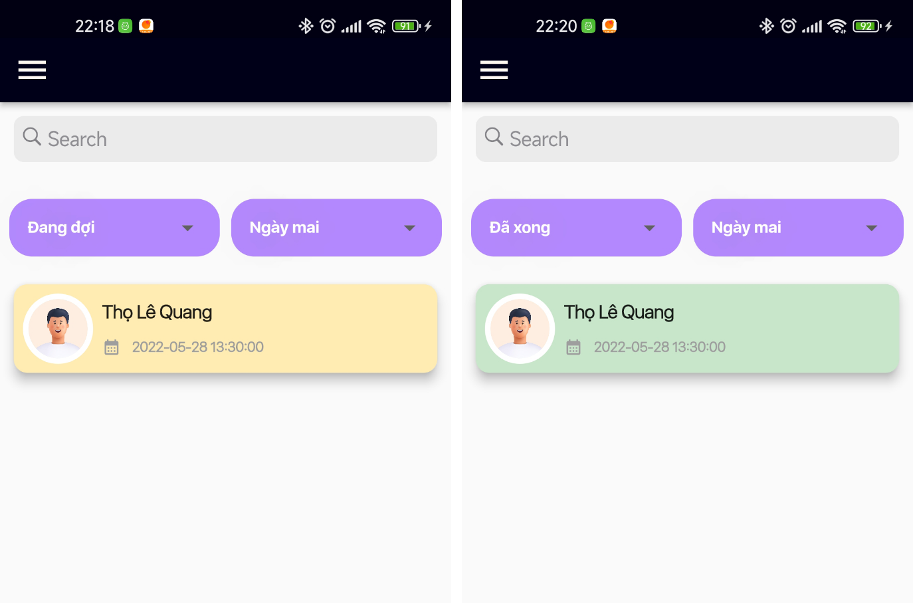

Hình 3.16. Trạng thái của lịch đặt của khách

Nếu khách chưa tới để sử dụng dịch vụ thì thẻ sẽ có màu cam nhạt, ngược lại nếu khách đã tới sử dụng dịch vụ, nhân viên đã chụp ảnh báo cáo và thanh toán đơn đặt lịch của khách và gửi lên thì sẽ có màu xanh lá.

Đối với những đơn đặt đã hoàn thành thì chỉ được phép xem lại thông tin không được phép tự ý chỉnh sửa. Với những đơn đặt chưa hoàn thành thì thợ cắt tóc phải chụp ảnh báo cáo và xác nhận khách đã thanh toán và gửi lên hệ thống để thay đổi trạng thái đơn đặt từ đang đợi sang đã hoàn thành

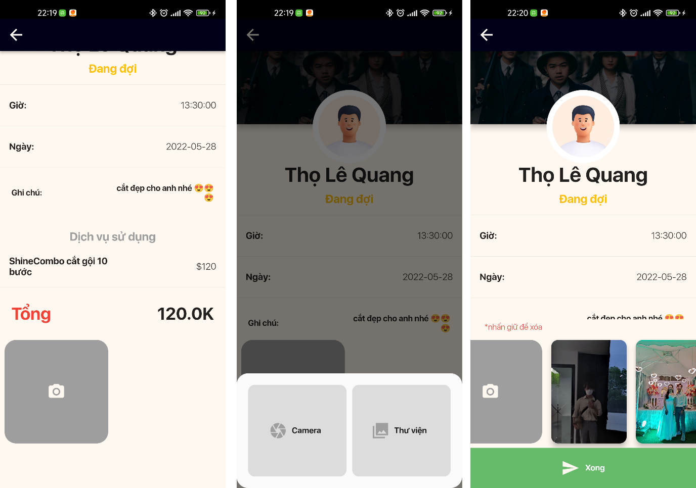

Hình 3.17. Báo cáo và xác nhận khách đã thanh toán

Để gửi báo cáo và xác nhận khách đã thanh toán thì thợ cắt tóc cần xin phép khách cho phép chụp, chọn từ 1 - 4 ảnh chụp để báo cáo về kết quả làm việc.

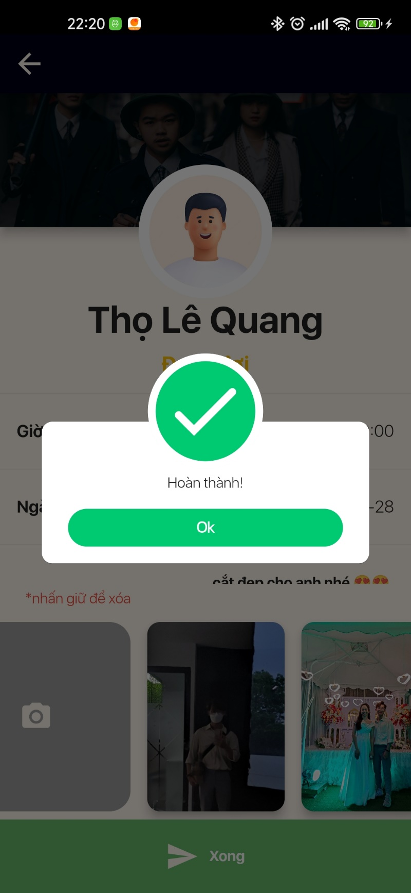

Hình 3.18. Báo cáo thành công

### Chức năng đăng bài từ ảnh nhân viên báo cáo

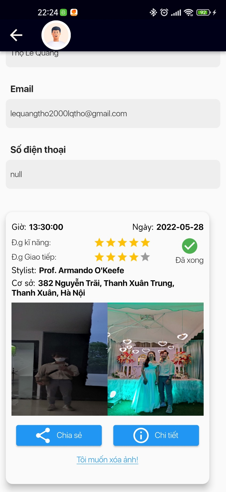

Hình 3.19. Lịch sử đặt lịch

Sau khi thợ cắt tóc chụp ảnh báo cáo và gửi lên thì người dùng sẽ thấy trạng thái được sửa là đã xong và có thêm nút chia sẻ.

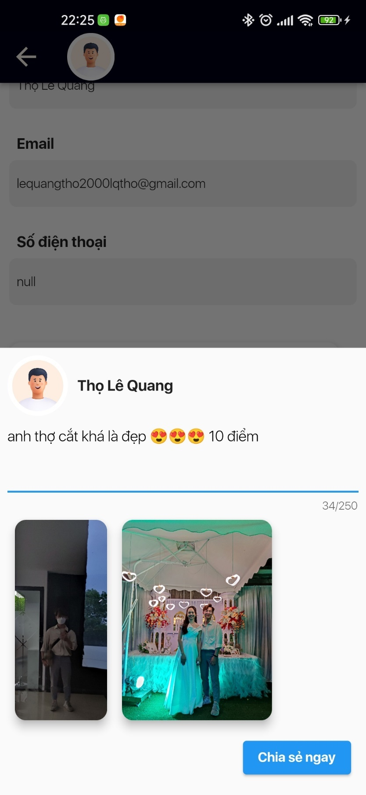

Hình 3.20. Thêm mô tả cho bài đăng

Hình phía trên là sau khi người dùng nhấn nút chia sẻ. Người dùng sẽ viết thêm mô tả cho bài đăng với tối đa 250 kí tự.

### Chức năng like bài viết

Hình 3.21. Like bài viết

Người dùng có thể nhấn 2 lần liên tiếp vào ảnh để like bài viết hoặc nhấn vào nút hình trái tim ở góc dưới bên trái mỗi bài viết.

Ở trang bản tin, danh sách bài viết sẽ chỉ hiển thị các bài viết trong tháng hiện tại và sắp xếp từ cao tới thấp theo lượt thích.

### Chức năng xóa bài viết

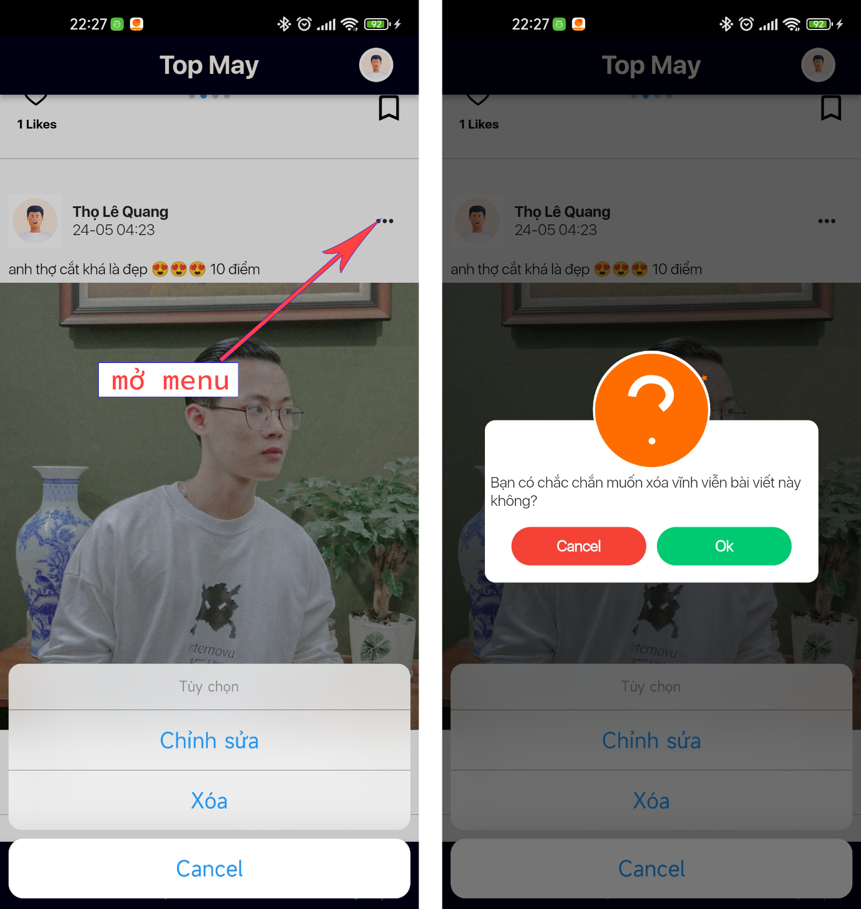

Hình 3.22. Xóa bài viết

Nếu người dùng nhấn xóa bài viết ở trong tùy chọn thì hệ thống sẽ yêu cầu người dùng xác nhận lại. Vì bài viết có ảnh hưởng tới bảng xếp hạng lượt thích. Vì thế khi khách hàng xóa sẽ là xóa vĩnh viễn.

# Kết luận

**1. Kết quả đạt được**

Sau nhiều ngày xây dựng, từ những bước rất nhỏ như tìm tông màu phù hợp cho phong cách của cửa hàng cắt tóc để làm màu chủ đạo trong ứng dụng đặt lịch cắt tóc cho đến những icon trong ứng dụng. Ứng dụng mà em xây dụng cũng đã học hỏi rất nhiều từ một chuỗi cửa hàng rất lớn về dịch vụ chăm sóc tóc nam đó là **30 Shine.**

Qua quá trình làm đồ án, có thể nói rằng kí năng làm việc và kĩ thuật lập trình, kĩ năng phân tích hệ thống đã được nâng cao hơn. Phân tích nghiệp vụ cũng từ đó mà đi lên. Kĩ năng xử lí hệ thống back-end cũng đã được cải thiện hơn rất nhiều.

Tuy ứng dụng còn khá sơ sài, nhưng chức năng chính nhất của ứng dụng là giúp người dùng có thể thuận tiện trong vieejxc đặt lịch cắt tóc cho mình thì đã hoàn thành và hoạt động khá tốt. Những tính năng bổ trợ như báo cáo lịch đặt đã xong, đăng bài, đăng kí, đăng nhập, … cũng đã hoàn thành theo đúng kế hoạch vạch ra từ đầu.

**2. Hạn chế**

Trong quá trình làm đồ án, khó khăn lớn nhất mà em gặp phải có lẽ là vấn đề phải hoàn thành dự án một mình. Việc một mình phải ôm đồm tất cả mọi thứ, tự xây dựng database, tạo các API, tự viết giao diện, tự thiết kế giao diện (có tham khảo tuy nhiên đã thay đổi rất nhiều) sẽ dẫn đế kết quả không được tốt. Có tương đối nhiều lỗi sảy ra trong quá trình xây dựng. Đã có những lúc phía back-end phải đập đi xây lại hoàn toàn, đổi công nghệ mới.

Trong thực tế định hướng công việc của em tập trung nhiều hơn vào phần front-end, mobile app vì thế kĩ năng lập trình hệ thống back-end còn yêu kém.

**3. Hướng phát triển**

Trong tương lai, ứng dụng sẽ vấn được phát triển thêm nhiều tính năng khác ví dụ như: tích hợp cửa hàng mua bán sản phẩm mĩ phẩm nam, trang phục nam, đăng nhập với nhiều nền tảng khác, phát triển mạnh hơn những công cụ hỗ trợ dành cho quản trị viên, chia sẻ ảnh và bài viết lên các nền tảng mạng xã hội khác…. Giao diện sẽ được thiết kế lại cho bắt mắt, thoáng và sạch hơn.

Về phía back-end, cơ sở dữ liệu sẽ được chỉnh sử lại, mở rộng hơn. Phần code cũng sẽ được chỉnh sửa lại sao cho chính xác hơn.

# Tài liệu tham khảo

| [1]  | innologic. [Trực tuyến]. Available: https://www.innologic.in/mobile-apps/.                                        |
|------|-------------------------------------------------------------------------------------------------------------------|
| [2]  | T. Otwell. [Trực tuyến]. Available: https://lumen.laravel.com/docs/.                                              |
| [3]  | flutter-dev. [Trực tuyến]. Available: https://flutter.dev/.                                                       |
| [4]  | 3. Shine, “30 Shine,” [Trực tuyến]. Available: https://30shine.com/.                                              |
| [5]  | P. T. N. B. Tường, Cơ sở dữ liệu quan hệ và ứng dụng, NXB Thông tin - Truyền thông, 2011.                         |
| [6]  | R. C. Martin, Clean Code - Mã Sạch Và Con Đường Trở Thành Lập Trình Viên Giỏi, NXB Dân Trí, 2022.                 |
| [7]  | T. Đ. QUẾ, GIÁO TRÌNH PHÂN TÍCH VÀ THIẾT KẾ HỆ THỐNG THÔNG TIN, Hà Nội: Học viện Công nghệ Bưu chính Viễn thông.  |
